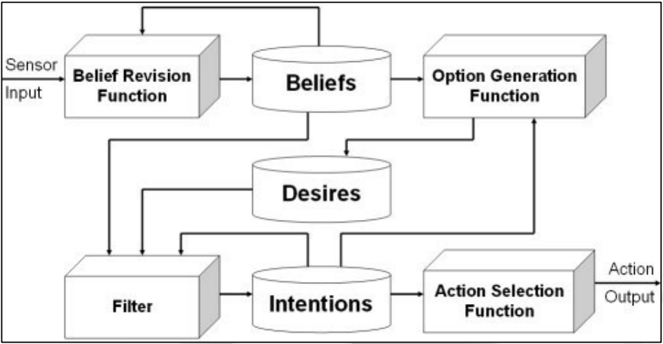

# BDI 4 JADE II

###### tags: `SID-lab`

* [Usando beliefs](#usando-beliefs)
* [Crear jerarquías de objetivos](#crear-jerarquías-de-objetivos)
* [Objetivos basados en creencias](#objetivos-basados-en-creencias)
* [Objetivos basados en mensajes](#objetivos-basados-en-mensajes)
* [Monitorización de objetivos](#monitorización-de-objetivos)
* [Controlar el ciclo BDI](#controlar-el-ciclo-bdi)
* [Replanificación](#replanificación)


---

## Usando beliefs

* Cada capability incluye una base de creencias (BeliefBase):
    ```java ('*.java')
    // this es un SingleCapabilityAgent
    Capability cap = this.getCapability();
    BeliefBase beliefBase = cap.getBeliefBase();
    ```
* Los Beliefs incluidos en BDI4JADE no son persistentes, pero se puede extender la clase base Belief para guardarlos.
* Los Beliefs pueden contener cualquier tipo de objeto (K, V).
* Clases básicas disponibles:
    * TransientBelief<K,V>: objeto a valor.
    * TransientBeliefSet<K,V>: objeto a conjunto de valores.
    * TransientPredicate\<K>: objeto a booleano.
    
```java ('*.java')
    // TransientBelief
    Belief currentPosition = new TransientBelief("currentPosition", new int[]{0 , 0});
    
    // TransientBeliefSet
    Set objects = new HashSet();
    objects.add("a");
    objects.add("b");
    objects.add("c");
    Belief hasObjects = new TransientBeliefSet("hasObjects", objects);

    // TransientPredicate
    Belief playerAlive = new TransientPredicate("playerAlive", true);

    // Add beliefs to capability's belief base
    beliefBase.addBelief(currentPosition);
    beliefBase.addBelief(hasObjects);
    beliefBase.addBelief(playerAlive);

    // Get all beliefs from all capabilities
    System.out.println(this.getBeliefs());
```
* El *name* (de tipo K) identifica el belief dentro de un BeliefSet.
* Si intentamos añadir dos beliefs con el mismo *name* (independientemente del valor), el agente fallará con una excepción:
    ```java=1 ('*.java')
    beliefBase.addBelief(new TransientPredicate("playerAlive", true));
    beliefBase.addBelief(new TransientPredicate("playerAlive", false));
    ```
    
* Para actualizar un belief podemos usar `BeliefSet.updateBelief` o `BeliefSet.addOrUpdateBelief`:
    ```java ('*.java')
    Belief playerAlive = new TransientPredicate("playerAlive", true);
    beliefBase.addOrUpdateBelief(playerAlive);
    beliefBase.updateBelief("playerAlive", false);
    ```


---

## Crear jerarquías de objetivos

* Los goals se pueden estructurar usando las clases `ParallelGoal` y `SequentialGoal`:
    ```java ('*.java')
    Set goals = new HashSet();
    goals.add(new HelloGoal("1"));
    goals.add(new HelloGoal("2"));
    goals.add(new HelloGoal("3"));
    goals.add(new HelloGoal("4"));
    ParallelGoal parallelGoal = new ParallelGoal(goals);
    this.addGoal(parallelGoal);
    ```
* `ParallelGoal` añade intentions para todos los subgoals:
    * Sus planes se ejecutan concurrentemente.
    * El `ParallelGoal` se cumple sólo cuando se cumplen **todos** los subgoals.
* SequentialGoal añade un subgoal como intention sólo cuando el anterior se ha cumplido con éxito.

---


## Objetivos basados en creencias

* Podemos especificar un belief como objetivo del agente:
    * `BeliefValueGoal(name, value)`
    * `BeliefSetHasValueGoal(name, value in Set)`
    * `BeliefPresentGoal/BeliefNotPresentGoal(name)`
    * `BeliefNotNullValueGoal(name)`
    * `PredicateGoal(name, boolean)`
* Para crear planes que mapeen estos objetivos podemos usar los métodos estáticos de la clase `GoalTemplateFactory`:
    * `hasBeliefValue(name, value)`
    * `hasBeliefOfValueType(name, valueClass)`
    * `hasValueOfTypeInBeliefSet(name, valueClass)`
* El `PlanBody` debería instanciar `BeliefGoalPlanBody`:
    * Más eficiente al ahorrar comprobaciones en el `BeliefSet`.
    * Nos podemos saltar el `endState = SUCCESSFUL`.
* Código en la constructora del agente:
    ```java ('*.java')
    // 1. Goal based on belief (predicate -> boolean value)
    this.addGoal(new PredicateGoal("readyToStart", true));
    // 2. Create goal template for matching all readyToStart predicate goals
    // with any value (true or false)
    GoalTemplate goalTemplate = GoalTemplateFactory.hasBeliefValueOfType(
        "readyToStart", Boolean.class);
    // 3. Create plan
    Plan beliefPlan = new DefaultPlan(goalTemplate, ReadyPlanBody.class);
    planLibrary.addPlan(beliefPlan);
    ```
* Código del PlanBody:
    ```java ('*.java')
    public class ReadyPlanBody extends BeliefGoalPlanBody {
        @Override
        protected void execute() {
            PredicateGoal goal = (PredicateGoal) this.getGoal();
            this.getBeliefBase().addOrUpdateBelief(
                new TransientPredicate("readyToStart", true)
            );
        }
    }
    ```

---


## Objetivos basados en mensajes

* Podemos definir planes basados en un MessageTemplate:
```java ('*.java')
Plan replyPlan =
    new DefaultPlan(MessageTemplate.MatchOntology("some-ontology"),
        ReplyPlanBody.class);
planLibrary.addPlan(replyPlan);
```
* El PlanBody recibe el mensaje usando la anotación Parameter de BDI4JADE:
```java ('*.java')
public class ReplyPlanBody extends AbstractPlanBody {
    private ACLMessage msgReceived;
    
    @Override
    public void action() {
        ACLMessage reply = msgReceived.createReply();
        reply.setContent("reply");
        this.myAgent.send(reply);
        setEndState(Plan.EndState.SUCCESSFUL);
    }
    
    @Parameter(direction = Parameter.Direction.IN)
    public void setMessage(ACLMessage msgReceived) {
        this.msgReceived = msgReceived;
    }
}
```


---

## Monitorización de objetivos

* Es posible definir un `GoalListener` y asociarlo al agente para recibir en tiempo real información sobre la consecución de los goals:
```java ('*.java')
this.addGoalListener(new GoalListener() {
    @Override
    public void goalPerformed(GoalEvent goalEvent) {
        System.out.println(goalEvent);
    }
});
```

---

## Controlar el ciclo BDI



**Aunque BDI4JADE usa un ciclo BDI simplificado, es posible modificar las funciones de:**
* Revisión de beliefs 
* Generación de objetivos activos (options)
* Generación de intenciones activas (filtering)
* Selección de plan bodies (action selection)

**Comportamiento por defecto:**
* No modifica
* Todos los objetivos contextualmente válidos
* Todos los objetivos generan intenciones
* Plan body aleatorio entre todos los que cumplen cada intención

**Interfaces a instanciar:**
* AgentBeliefRevisionStrategy
* AgentOptionGenerationFunction
* AgentDeliberationFunction
* AgentPlanSelectionStrategy


---

## Replanificación

* Bajo ciertas condiciones, el agente replanificará siguiendo el ciclo de razonamiento:
    * **Si el PlanBody acaba con `EndState == FAILED`:** En este caso, se escogerá otro Plan que cumpla con el mismo objetivo que tenía asignado el plan fallido.
    ```java ('*.java')
    public void action() {
        if (planHasFailed) {
            setEndState(Plan.EndState.FAILED);
        } else {
            setEndState(Plan.EndState.SUCCESSFUL);
        }
    }
    ```
    * **Si el Plan retorna false en la sobreescritura de `isContextApplicable`:** Esta comprobación se hace antes de elegir plan, nunca durante la ejecución del plan body. Si retorna false, se escogerá otro plan, si existe.
    ```java ('*.java')
    Plan plan = new DefaultPlan(HelloWorldGoal.class, HelloWorldPlanBody.class) {
        @Override
        public boolean isContextApplicable(Goal goal) {
        // Se puede ejecutar este plan en este contexto?
        return false;
        }
    };
    ```
    * **Si un goal desaparece del agente:** Al desaparecer el objetivo, se interrumpe el plan body actual y tampoco habrá replanificación para dicho objetivo. Proactividad: también se pueden añadir objetivos, dinámicamente, desde los `action()`.
    ```java ('*.java')
    public void action() {
        AbstractBDIAgent agent = (AbstractBDIAgent) getAgent();
        agent.dropGoal(agent.getGoals().iterator().next());
    }
    ```
