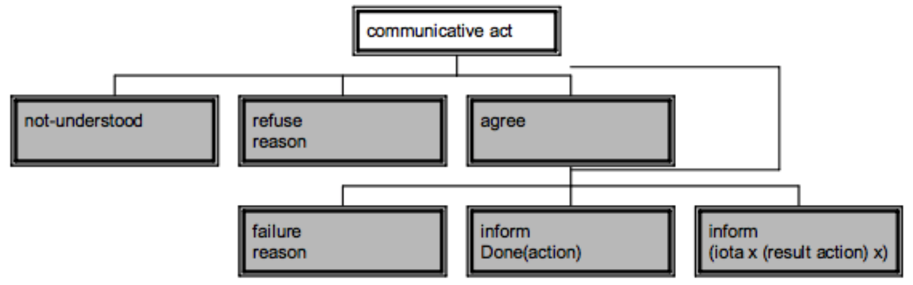

# Introducción a JADE

[//]: # (Poner aqui link al pdf)

###### tags: `SID-lab`

---
* **Referencias**:
     * http://jade.tilab.com/documentation/tutorials-guides/
        * JADE Administrador’s Guide
        * JADE Programming for Beginners
    * http://jade.tilab.com/documentation/examples/
---

## Setup del entorno

[//]: # (Poner aqui link al código)
[//]: # (añadir la info que tengo yo del setup)

* Descargas:
    * jade.jar: https://jade.tilab.com/dl.php?file=JADE-all-4.5.0.zip
    * commons-codec-1.3.jar: https://repo1.maven.org/maven2/commons-codec/commons-codec/1.3/commons-codec-1.3.jar
    * ejemplos: https://gitlab.fib.upc.edu/sergio.alvarez-napagao/material-sid
* Configuración del CLASSPATH:
    * `JADE-all-4.5.0/JADE-bin-4.5.0/jade/lib/jade.jar`
    * commons-codec-1.3.jar
    * Directorio que guarda los .class (e.g. `output/ o classes/`)
    * `export CLASSPATH="$CLASSPATH:<JARS_AND_FOLDERS>"`
* Arrancamos la GUI:
    * `java jade.Boot –gui`
    * Si no tenemos el CLASSPATH siempre podemos usar `–cp u java –cp lib/jade.jar jade.Boot –gui`

---


## Agentes

* Una clase de agente se crea:
    * Extendiendo la clase `jade.core.Agent`
    * Y redefiniendo el método `setup()`
* Cada instancia se identifica con un AID (`jade.core.AID`)
    * AID: se compone de un nombre único más la dirección de la plataforma
    * Podemos recuperar el AID de un agente mediante el método `getAID()` de la clase `Agent`


```java ('*.java')
import jade.core.Agent;

public class HelloWorldAgent extends Agent {
    
    protected void setup() {
        System.out.println.("Hello World! my name is " + getAID().getName());
    }
}
```

### Nombres locales, GUID y direcciones


* Nombre agente: `<nombre-local>@<nombre-plataforma>`
    * Nombre-local es único (localmente).
    * El nombre completo ha de ser único globalmente.
* Para especificar el nombre de la plataforma al arrancarla: opción `–name`
* Dentro de la plataforma nos referimos al agente usando únicamente su nombre-local

```java ('*.java')
AID localId = new AID(localname, AID.ISLOCALNAME);
AID globalId = new AID(name, AID.ISGUID);
```


### Paso de parámetros

* Pasar parámetros a un agente: `java jade.Boot .. ´A:myPackage.MyAgent(arg1 arg2)´`
* Recuperar los argumentos con el método `getArguments()` de la clase `Agent`

```java ('*.java')
protected void setup() {
    Object[] args = getArguments();
    if (args != null) {
        System.out.println("Hello, my arguments are:")
        for (int i = 0; i < args.length; ++i) {
            System.out.println("- " + args[i]);
        }
    }
}
```

### Expiración del agente
* El agente termina su ejecución cuando se llama a su método `doDelete()`
* Durante su terminación se invoca el método `takeDown()` (e.g., para realizar operaciones de limpieza)


```java ('*.java')
protected void setup() {
    System.out.println.("Hello World! my name is " + getAID().getName());
    Object[] args = getArguments();
    if (args != null) {
        System.out.println("Hello, my arguments are:")
        for (int i = 0; i < args.length; ++i) {
            System.out.println("- " + args[i]);
        }
    }
    doDelete();
}

protected void takeDown() {
    System.out.println("Bye...");
}
```


### Construyendo un agente

* `setup()`: método para preparar el agente; se ejecuta una vez.
    * Registro en el DF.
    * Iniciar todos los behaviours requeridos.
    * Es obligatorio que haya al menos un behaviour en el setup.
* `takeDown()`: al finalizar el agente
    * Eliminar del registro del DF.
    * Cerrar todos los recursos abiertos/requeridos…


### Ciclo de vida del agente

<center></center>


### Estados del agente


| State     | Description | 
| --------  | -------- | 
| Initiated | The agent object is built, but hasn't registered itself with AMS, has neither name nor an addressand can't communicate with other agents. | 
| Active    | The agent object is registered with AMS, has regular name and address, can access all the various JADE features. | 
| Suspended | The agent object is currently stopped. Its internal thread is suspended and no agent behaviour is being executed. | 
| Waiting   | The agent is blocked, waiting for something. Its internal thread is sleeping on a JAVA monitor and will wake up when some conditions are met (for example when message arrives). | 
| Deleted   | The agent is definitely dead. The internal thread has terminated its execution and the agent is no more registered with AMS. | 
| Transit   | The mobile agent enters this state while it is migrating to the new location. The system continues to buffer messages that will then be sent to its new location. | 


<center></center>


---


## Comportamientos (*Behaviours*)

* Los agentes realizan sus tareas mediante *behaviours*.
* Los *behaviours* se crean extendiendo la clase`jade.core.behaviours.Behaviour`
* Para que un agente ejecute una tarea basta con:
    * Crear una instancia de la subclase `Behaviour` correspondiente.
    * Llamar al método `addBehaviour()` de la clase `Agent`
* Cada *behaviour* debe implementar:
    * `public void action()`: Qué hace el *behaviour*.
    * `public boolean done()`: Cierto si ya ha finalizado.


### Planificación y ejecución de Behaviours

* Un agente puede ejecutar varios comportamientos en paralelo.
* La planificación de estas ejecuciones no es **preferente**.
    * No es determinista a la hora de seleccionar un behaviour si hay varios disponibles.
        * Cola con round-robin con planificación colaborativa.
* Todo ocurre en el mismo thread de Java.
* Los cambios de behaviour a ejecutar ocurren cuando el método `action` del behaviour que se está ejecutando finaliza.


### Tipos de Behaviours

* #### <u>Heredan de la clase `SimpleBehaviour`:</u>

    * **One shot** (`jade.core.behaviours.OneShotBehaviour`)
        * `action()`: se ejecuta una vez (se completa inmediatamente).
        * `done()`: simplemente devuelve `true`.
    * **Cyclic** (`jade.core.behaviours.CyclicBehaviour`)
        * `action()`: ejecuta la misma operación cada vez que se invoca (nunca se completa).
        * `done()`: simplemente devuelve `false`.
    * **Waker** (`jade.core.behaviours.WakerBehaviour`)
        * `onWake()`: a implementar en las subclases, se ejecuta tras un tiempo dado (timeout).
        * `action()` y `done()`: ya están implementados para que el método `onWake()` se ejecute tras el timeout.
        * Tras su ejecución, el *behaviour* queda completado.
    * **Ticker** (`jade.core.behaviours.TickerBehaviour`)
        * `onTick()`: a implementar en las subclases, se ejecuta periódicamente según un periodo dado.
        * `action()` y `done()`: ya están implementados para que el método `onTick()` se ejecute a cada periodo.
        * El *behaviour* se ejecuta para siempre a menos que se ejecute su método `stop()`


* #### <u>Heredan de la clase `CompositeBehaviour`:</u>

    * `SequentialBehaviour`: Ejecuta todos los *sub-behaviours* secuencialmente.
    * `ParallelBehaviour`: Ejecuta todos los *sub-behaviours* asíncronamente.
    * `FSMBehaviour`: Ejecuta todos los *sub-behaviours* definiendo una máquina de estados.
    * Utilizaremos el método` addSubBehaviour(Behaviour b)`


### Empezar y acabar los Behaviours

* `onStart()`
    * Se ejecuta una vez antes de ejecutar el método `action()`
    * Indicado para operaciones que tengan que ocurrir al inicio del *behaviour*.
* `onEnd()`
    * Se ejecuta una vez después de que el método `done()` devuelva `true`
    * Indicado para operaciones que tengan que ocurrir al final del behaviour.
* Cada behaviour tiene un apuntador al agente que lo ejecuta: el atributo protegido `myAgent`
* `removeBehaviour()`
    * Elimina un *behaviour* del pool de *behaviours* de un agente.
    * No se llama al método `onEnd()`
* Cuando el *pool* de *behaviours* de un agente está vacío, el agente pasa a un estado inactivo (IDLE state) y su thread entra en modo *sleep*.


---


## Directory Facilitator (DF)

* Recordad que el DF es un agente también.
* Clase `jade.domain.DFService`
    * `register()`
    * `modify()`
    * `deregister()`
    * `search()`


<center></center>


### Registro

* Normalmente en el setup nos registraremos en el DF.
    * Usaremos un `DFAgentDescription` para indicar:
        * el ID del agente (`getAID()`).
        * los servicios que ofrece.
    * Usaremos un `ServiceDescription` para cada servicio, indicando:
        * el nombre del servicio (`string`).
        * el tipo de servicio (`string`).
        * una ontología (opcional).
        * un lenguaje del contenido (e.g., FIPA_SL, también opcional).


```java ('*.java')
DFAgentDescription dfd = new DFAgentDescription();
dfd.setName(getAID());
ServiceDescription sd = new ServiceDescription();
sd.setName(serviceName);
sd.setType("weather-forecast");

// Agents that want to use this service need to
// "know" the weather-forecast-ontology
sd.addOntologies("weather-forecast-ontology");

// Agents that want to use this service need to
// "speak" the FIPA-SL language
sd.addLanguages(FIPANames.ContentLanguage.FIPA_SL);
sd.addProperties(new Property("country", "Italy"));
dfd.addServices(sd);
```

### Búsqueda

* Usaremos un `DFAgentDescription` y un `ServiceDescription` como template del agente/servicio que buscamos.
* Usaremos un `SearchConstraints` para añadir restricciones a la búsqueda (como la cantidad de resultados).
* Enviaremos una petición de búsqueda al `DFService`
* De los resultados obtendremos el AID del proveedor.

```java ('*.java')
// Build the description used as template for the search
DFAgentDescription template = new DFAgentDescription();
ServiceDescription templateSd = new ServiceDescription();
templateSd.setType("weather-forecast");
template.addServices(templateSd);

SearchConstraints sc = new SearchConstraints();
// We want to receive 10 results at most
sc.setMaxResults(new Long(10));

DFAgentDescription[] results = DFService.search(this, template, sc);
if (results.length > 0) {
    DFAgentDescription dfd = results[0];
    AID provider = dfd.getName();
}
```
---

## Modelo de comunicación


* Basado en el paso de mensajes asíncrono.
* Formato de mensajes definido por el lenguaje ACL (FIPA).


<center></center>


### La clase ACLMessage

* Los mensajes intercambiados por los agentes son instancias de la clase `jade.lang.acl.ACLMessage`
* Define métodos de acceso (getters/setters):
    * `get/setPerformative()`
    * `get/setSender()`
    * `add/getReceiver()`
    * `get/setLanguage()`
    * `get/setOntology`
    * `get/setContent()`

### Envío y recepción de mensajes

* Enviar un mensaje consiste básicamente en crear un objeto `ACLMessage` y llamar al método `send()` de `Agent`

```java ('*.java')
ACLMessage msg = new ACLMessage(ACLMessage.INFORM);
msg.addReceiver(new AID ("Peter", AID.ISLOCALNAME));
msg.setLanguage("English");
msg.setOntology("Weather-Forecast-Ontology");
msg.setContent("Today it's raining");
send(msg);
```


* Para procesar mensajes de la cola de mensajes privada, el Agent ejecuta el método `receive()`

```java ('*.java')
ACLMessage msg = receive();
if(msg != null) {
    //Process the message
}
```

* El uso continuo de `receive()` es ineficiente.
* Mejor utilizar `block()`
* Permite bloquear el *behaviour* del pool del agente sin bloquear a este.
* Cada vez que llegue un mensaje se desbloquean los *behaviours* bloqueados para que puedan leerlo.
* Método `blockingReceive()` disponible (pero peligroso).
    * Bloquea todo el agente y no deja que se ejecute ningún otro *behaviour* hasta que llegue el mensaje.

```java ('*.java')
public void action() {
    ACLMessage msg = myAgent.receive();
    if(msg != null) {
    //Process the message
    }
    else {
        block();
    }
}
```

### Message templates

* Es más seguro hacer uso de *message templates*.

```java=1 ('*.java')
MessageTemplate tpl = MessageTemplate.MatchOntology("Test-Ontology");

public void action() {
    ACLMessage msg = myAgent.receive(tlp);
    if(msg != null) {
        //Process the message
    }
    else {
        block();
    }
}
```
* Podemos hacer Match con los diferentes elementos de un mensaje:
    * `Conversation-id`, `Ontology`, `Language`, `Content`, `Performative`
* Podemos hacer composición mediante `and`, `or` y `not`


### Paso de mensajes


| performative    | passing info | requesting info | negotiation | performing actions | error handling |
| --------        | --------     | --------        | --------    | --------           | ------         |
| accept-proposal |              |                 | X           |                    |                |
| agree           |              |                 |             | X                  |                |
| cancel          |              | X               |             | X                  |                |
| cfp             |              |                 | X           |                    |                |
| confirm         | X            |                 |             |                    |                |
| disconfirm      | X            |                 |             |                    |                |
| failure         |              |                 |             |                    |  X             |
| inform          | X            |                 |             |                    |                |
| inform-if       | X            |                 |             |                    |                |
| inform-ref      | X            |                 |             |                    |                |
| not-understood  |              |                 |             |                    |  X             |
| propose         |              |                 | X           |                    |                |
| query-if        |              | X               |             |                    |                |
| query-ref       |              | X               |             |                    |                |
| refuse          |              |                 |             | X                  |                |
| reject-proposal |              |                 | X           |                    |                |
| request         |              |                 |             | X                  |                |
| request-when    |              |                 |             | X                  |                |
| request-whenever|              |                 |             | X                  |                |
| subscribe       |              | X               |             |                    |                |


### Protocolos de interacción



* Secuencias predefinidas de intercambio de mensajes. En todos ellos se distingue:
    *  Un **Initiator**, que permite gestionar varios Responders a la vez; es un comportamiento que:
        * Termina una vez se alcanza un estado final.
        * Se puede resetear para reutilizar el objeto (método `reset()`).
    * Uno o más **Responder**, que son implementados por behaviours cíclicos y que vuelven a reintroducirse una vez alcanzan un estado final.
* **Referencias**:
    * Capítulo 3.5 de la guía de programación de JADE.
    * Documentación de la API (javadoc) de `jade.proto`.
    * Ejemplos de código en `examples.protocols` incluido en la distribución JADE.

### Soporte a los protocolos de interacción

* El paquete `jade.proto` contiene behaviours para los roles que inician y responden a los protocolos más comunes:
    * FIPA-request (AchieveREInitiator/Responder)
    * FIPA-Contract-Net (ContractNetInitiator/Responder)
    * FIPA-Subscribe (SubscriptionInitiator/Responder)
* Todas estas clases automáticamente se encargan de:
    * Comprobar el flujo de mensajes para validar que se corresponde al protocolo.
    * De los timeouts (si hay alguno).
* Proveen de métodos de callback que se deben redefinir para tomar las acciones necesarias en los diferentes estados del protocolo; por ejemplo, cuando un mensaje es recibido o expira un timeout.

### AchieveREInitiator/Responder

* A lo largo de las últimas versiones JADE se han ido aglutinando los protocolos bajo una misma interfaz: **AchieveREInitiator/Responder** o **SimpleAchieveREInitiator/Responder** (más rápido pero con menos opciones).
* En general con esta clase podremos iniciar los protocolos más típicos (e.g., Request, Query).
* Al crear una instancia le pasaremos a la constructora el mensaje (`ACLMessage`) que queremos enviar: Iniciar el mensaje con el valor correcto de protocolo.
* Podemos iniciarlo con un mensaje incompleto y terminarlo reescribiendo la función `prepareRequests`.
* En general podemos extender la clase y sobreescribir las funciones handle… que gestionan los diferentes estados del protocolo (`refuse`, `agree`, `response`).
* Si queremos enviar a varios responders, añadimos a todos en el mensaje. En este caso suele ser útil modificar la función `handleAllResponses`, `handleAllResultNotifications`.
* En general una vez enviado el mensaje primero recibiremos la primera respuesta (`agree`, `not-understood`, `refuse`) llamando a `handleResponse`.
* Y luego, si estaba de acuerdo, el resultado (`failure`, `inform`).
* En la constructora le pasaremos el template de mensaje sobre el que querremos responder. Normalmente indicaremos el protocolo y la performativa. Podemos usar también `createMessageTemplate`.
* Para esta clase podremos reescribir las funciones `prepare`… para gestionar los diferentes estados (en especial, `prepareResponse` y `prepareResultNotification`). Considerad utilizar la función `createReply` que se puede llamar mediante la request recibida, así evitamos errores.
* SimpleAchieveREInitiator/Responder: 
    * Es una versión más compacta y rápida que el protocolo normal.
    * No permite registrar behaviours como handlers.
    * No permite tener más de un responder.
    * Si nuestro protocolo es 1:1 esta sería la mejor opción.
    * Podemos igualmente sobreescribir cualquier handler como en el caso anterior.
* Ejemplo sencillo:
```java ('*.java')
ACLMessage request=new ACLMessage(ACLMessage.REQUEST)

request.setProtocol(FIPANames.InteractionProtocols.FIPA_REQUEST);
request.addReceiver(new AID("receiver", AID.ISLOCALNAME));
myAgent.addBehaviour(new AchieveREInitiator(myAgent, request) {
          protected void handle Inform(ACLMessage inform) {
            System.out.println("Protocol finished.Rational Effect achieved.
            Received the following message:"+inform);
         } 
});

Message Template mt=
AchieveREResponder.create Message Template(FIPANames.InteractionProtocols.FIPA_REQUEST);

myAgent.addBehaviour(new AchieveRE Responder(myAgent,mt) {
   protected ACLMessage prepareResultNotification(ACLMessage requ, ACLMessage resp) {
          System.out.println("Responder has received the following message:" + request);
          ACLMessage informDone = request.createReply();
          informDone.setPerformative(ACLMessage.INFORM);
          informDone.setContent("inform done");
          return informDone;
   }
});
```


### FIPA Contract-Net protocol


* ContractNetInitiatorAgent
* ContractNetResponderAgent
* Ejecuta los agentes
    * Consola
    * GUI sniffing
    * GUI introspector

---

## Gestión de contenido

### ACL Message

* Un ACL Message sigue una estructura fija:

    
    
* ACL: Content:
    * En este campo (`slot`) está el contenido del mensaje en forma de expresiones.
    * La librería de commons-codec se usa para codificar y decodificar estas expresiones que irán en dicho campo.
        * En `jade.content.lang` encontramos SL y LEAP.
        * Estas codifican las expresiones según el estándar especificado FIPA-SL y FIPA-LEAP. El primero es más legible.
        * Podríamos especificar otros codecs (XML, RDF, OWL).

### Content Manager

JADE, a través del Content Manager:
* Permite la codificación/decodificación del contenido de los mensajes (usando los codecs).
* Verifica que sean correctos (formatos, tipos) (usando la ontología).
* Como para los agentes JADE la manipulación es más cómoda con objetos Java que con Strings, requiere que la ontología este en ese formato.
* Básicamente serializa en un formato y lo deserializa. Al hacer esto último crea las instancias al reificar.
* Podríamos hacer agentes que manipulan los mensajes de una manera más compleja (AgentOWL).

### Ontología para JADE

* Necesitamos una ontología:
    * Definición de elementos de la ontología.
    * Definición de las clases Java correspondiente.
* Podríamos hacernos la ontología mediante clases Java tal y como define JADE (es decir, siguiendo sus convenciones)
    * Mirad en referencias (al final de las slides) - Tutorial.
* Para facilitarnos la vida podemos usar un plugin para Protégé que nos permitirá transformar una ontología en las clases Java para JADE.
    * https://protegewiki.stanford.edu/wiki/OntologyBeanGenerator
    * Necesitaremos una versión antigua de Protégé (3.4)
* **Usando la ontología**:
    1. Nos importaremos el código generado al proyecto.
    2. Crearemos instancias usando las clases (tanto para conceptos como propiedades).
    3. En el setup del agente registraremos en este el lenguaje y ontología. 
        ```java ('*.java')
        getContent Manager().register Language(new SLCodec(),FIPANames.Content Language.FIPA_SL0);
        getContentManager().registerOntology(NameOfOntology.getInstance());
        ```
    4. Crearemos el ACLMessage donde indicaremos la ontología.
        ```java ('*.java')
        ACLMessage request Msg=new ACLMessage(ACLMessage.REQUEST);
        requestMsg.add Receiver(((RequesterAgent)myAgent).engager);
        requestMsg.setLanguage(FIPANames.Content Language.FIPA_SLO);
        requestMsg.setOntology(EmploymentOntology.NAME);
        ```
    5. Mediante `myAgent.getContentManager.fillContent` añadiremos al mensaje creado las instancias.
        ```java ('*.java')
        try{
            myAgent.getContent Manager().fillContent(requestMsg,a);
        }
        catch(Exception pe){
        }
        ```
    6. En el receptor, utilizaremos la función `getContentManager().extractContent(msg)`. Después podemos comprobar con `instanceOf` de que clase son las cosas (si hiciera falta).
    7. En general utilizaríamos algún lenguaje de contenido como FIPA-SL para construir expresiones indicando si, por ejemplo, tenemos alguna cosa, si no tenemos esa cosa, si podemos descargar, etc…
        * Por ejemplo, para indicar que una persona no trabaja en X:
            ```java ('*.java')
            - (not(Works(Person:name XXX)(Company:name YYY)))
            - AbsPredicate not=new AbsPredicate(SLVocabulary.NOT);
              not.set(SLVocabulary.NOT_WHAT,...);
            ```
    8. Ojo, para las acciones (como descargar) tenemos que crear un objeto `Action` y después definir el actor y la acción concreta (`setActor` y `setAction`). Ese será el contenido del mensaje.
* **Referencias:**
    * Tutorial: APPLICATION-DEFINED CONTENT LANGUAGES AND ONTOLOGIES: http://jade.tilab.com/doc/tutorials/CLOntoSupport.pdf
