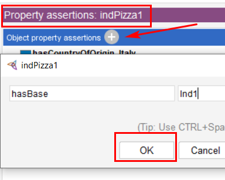

# Ejercicios - Ontologías, Protégé y OWL

###### tags: `SID-lab`

[ToC]

---

## Ejercicio 1

1. Descargad la ontología (https://raw.githubusercontent.com/owlcs/pizza-ontology/master/pizza.owl) y cargarla en Pretégé.
2. Añadid algún comentario (Annotations).
    
3. Cread una subclase de Thing (Entities).
    
4. Cread un hermano y una subclase de esta clase.
5. Haced que la clase y su hermano sean disjuntas (Disjoint With). No hace falta hacerlo para las dos.
    

---
    
## Ejercicio 2

Observad la diferencia entre `NamedPizza` y `RealItalianPizza`:
1. ¿Cuál es primitiva y cuál equivalente?
    `NamedPizza` es la primitiva y `RealItalianPizza` es la equivalente.
    
    
3. ¿Cuáles son las condiciones suficientes para que una pizza sea `RealItalianPizza`?
    Que sea una `Pizza` y que tenga como valor de `hasCountryOfOrigin`: `Italy`.
    
    
5. ¿Qué condiciones añade a las suficientes?
    Que tenga `only ThinAndCrispyBase`.
    
    
    
---

## Ejercicio 3

1. Arrancad el Reasoner incluído en Protégé. Se puede configurar para ampliar/acotar el ámbito de lógica.
2. Analizad inconsistencias:
    * Buscad las inconsistencias (en rojo).
    * ¿A qué se deben estas inconsistencias?
    * Usad el símbolo de interrogación para obtener explicaciones.
    
    
    
    
    
3. Analizad la clasificación del razonador.
    * Buscad las inferencias de clasificación (en amarillo).
    * Usad el símbolo de interrogación para obtener explicaciones.
    Por ejemplo:
    
    
    
4. Parad el Reasoner.

    

---

## Ejercicio 4

1. Cread una ObjectProperty para expresar en qué país se vende.

    
    * Asignad dominio y rango
    
    
2. Cread una subpropiedad de `hasIngredient` para poder representar el relleno del borde.
    
    * Asignad dominio y rango.
    * Asignad alguna restricción, como por ejemplo `disjoint with` o `inverse of`.
    
    
3. Cread una DataProperty para poder representar el precio.

    
    * Asignad dominio y rango.
    
    
    
    
---

## Ejercicio 5

* Cread una instancia de DeepPanBase (Individuals).

    
    
* Cread una instancia de Pizza con las siguientes propiedades:
    * Tiene como país de origen Italia.
    
    * Tiene como base la instancia de DeepPanBase que habéis creado.
   
    
    
* En el menú, arrancad el Reasoner
    * ¿Es inconsistente? ¿Por qué?

    
    
* Borrad estas instancias y volved a sincronizar el Reasoner.

---

## Ejercicio 6

* Cread un topping TurtleTopping.

    
* Cread una Pizza llamada SuperMarioPizza con condiciones necesarias y suficientes: tener como ingredientes champiñones y tortugas.
    
    
* Cread una instancia de una pizza de tipo Pizza con ingredientes instancias de champiñones y tortugas.
    
* Sincronizad el Razonador y observad cómo se clasifica.
    
* Cambiad SuperMarioPizza para que las condiciones sean sólo necesarias y observad la diferencia tras sincronizar.
    
    
    
---

## Ejercicio 7

* Cread las siguientes pizzas:
    * Pizza con marisco: contiene como mínimo marisco.
    
    
    * Pizza de marisco: todos los ingredientes son de marisco.
   
    
    * Pizza ecléctica: mínimo 10 ingredientes.
   
    
    * Pizza de oferta: máximo 2 ingredientes.
   
    
    * Pizza binaria: exactamente 2 ingredientes.
   
    
    * Pizza triqueso: exactamente 3 ingredientes, todos de queso.
    
    
    * Pizza escandinava:
        * Tendréis que editar en texto libre (Class Expression Editor) y también editar la clase Country.
        * Utilizad or y value (tenéis ejemplos en American y en la guía).
     
    
    * Pizza aburrida especial: pizzas que no sean InterestingPizza, pero que estén en la unión entre las MeatyPizza y las CheesyPizza.
    
    

---

## Ejercicio 8

1. Cread una propiedad funcional que asigne un creador a una NamedPizza (tendréis que crear clases).
    * Asignad dos creadores a una instancia de NamedPizza.
    
    * Sincronizad el Razonador.
    * Qué inferencia ha hecho?
    Ha determinado que las dos creadoras son el mismo individual.
    
    
2. Identificad los creadores como Different Individuals y resincronizad.

    
3. Cread una propiedad transitiva que permita representar que la creación de una NamedPizza está influenciada por otra.
    
4. Cread una propiedad simétrica que permita expresar que dos ingredientes combinan bien.
    
5. Observad las características disponibles en las data properties. ¿Tiene sentido?
    Si. Solo está disponible la `Funcional`.
