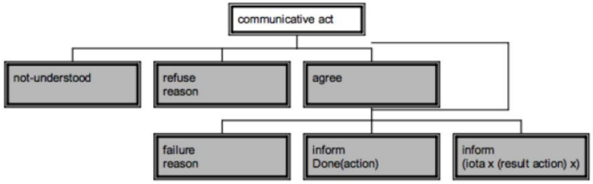
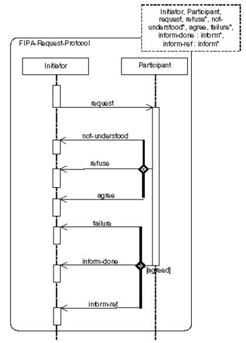
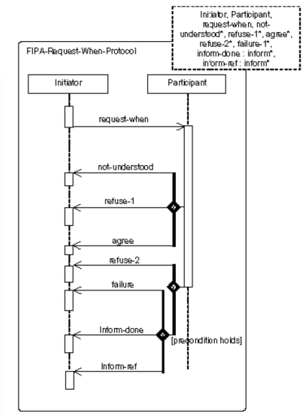
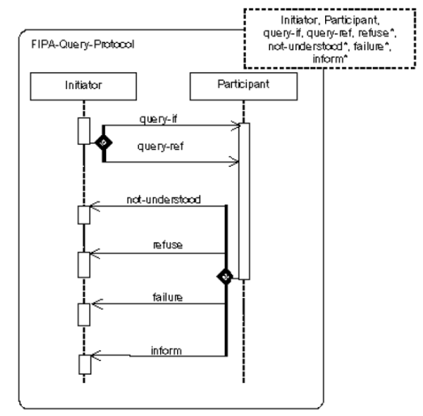
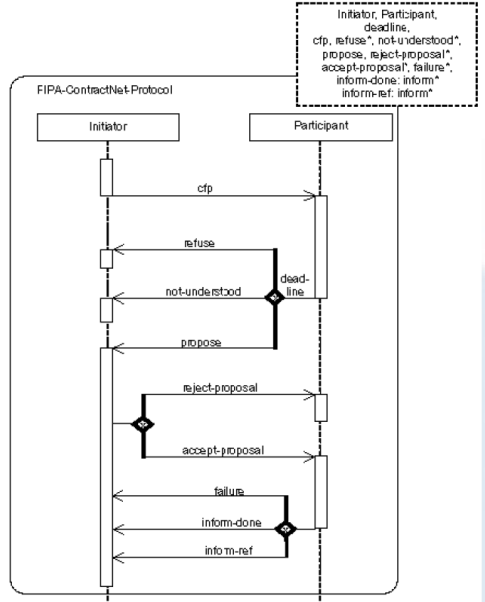
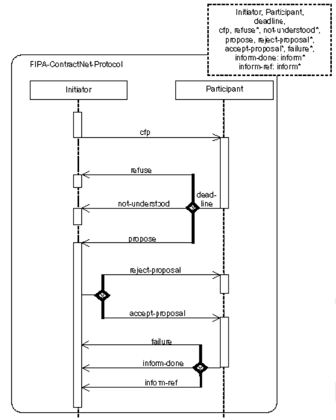

# Protocolos

###### tags: `SID-lab`


* [Interacciones entre agentes](#interacciones-entre-agentes)
* [¿Por qué se comunican?](#¿por-qué-se-comunican?)
* [Los agentes como base de conocimiento](#los-agentes-como-base-de-conocimiento)
* [Niveles en la comunicación](#niveles-en-la-comunicación)
* [FIPA-ACL](#fipa-acl)
   * [Protocolo de interacción](#protocolo-de-interacción)
   * [Protocolos FIPA](#protocolos-fipa)
   * [FIPA Contract-Net protocol](#fipa-contract-net-protocol)
   * [Soporte a los protocolos de interacción](#soporte-a-los-protocolos-de-interacción)
   * [AchieveREInitiator/Responder](#achievereinitiator-and-responder)
* [Limitaciones de los protocolos](#limitaciones-de-los-protocolos)


---

## Interacciones entre agentes

* Las interacciones entre agentes son inevitables.
    * Para alcanzar los objetivos:
        * Propios.
        * Comunes a un grupo de agentes.
    * Para tratar interdependencias con otros actores.
* Las interacciones ocurren en el *Knowledge level*.
    * Qué objetivos persigue el agente.
    * Bajo qué condiciones (cuándo).
    * Quién ejecuta cada acción.
* Flexibilidad para actuar autónomamente y comunicarse con el resto de agentes. E.g., programas síncronos.
* Motivación:
    * El intercambio de conocimiento es un signo de inteligencia.
    * El intercambio de conocimiento requiere comunicación.
* La idea principal detrás del paradigma de los sistemas multi-agente se basa en la existencia de entidades de software distribuidas y heterogéneas que se comunican entre ellas.
* El hecho de que los agentes sean diversos y heterogéneos implica que necesitamos un lenguaje común.

---

## ¿Por qué se comunican?

* Entendimiento mutuo.
    * Traducir entre lenguajes de representación.
    * Compartir el contenido semántico del lenguaje.
* Componentes de la comunicación a acordar:
    * Protocolo de interacción: Cómo se estructuran las conversaciones o diálogos.
    * Lenguaje de comunicación: Cual es el significado de cada mensaje.
* Protocolo de transporte.
    * Detalles técnicos sobre como los mensajes son enviados y recibidos por los agentes.
    * Oculto para los desarrolladores por parte de la plataforma JADE.
* Detalles técnicos sobre la arquitectura y el middleware.
    * Ya solucionado por los estándares FIPA.

---

## Los agentes como base de conocimiento

* Podemos considerar a los agentes inteligentes como bases (virtuales) de conocimiento.
* Tres niveles de representación:
    * Lenguaje o formalismo que permita representar el conocimiento del dominio: Ontología.
    * Lenguaje que permita expresar proposiciones:
        * Para habilitar el intercambio de información.
        * *Content Language* implícito en los mensajes.
* Lenguaje que permita expresar actitudes sobre esas proposiciones: ACL (Agent Communication Language).

---

## Niveles en la comunicación

* Semántica del mensaje:
    * Que quiere decir mensaje.
    * Subdividido en:
        * Tipo de mensaje: Intencionalidad.
        * Contenido del mensaje: Contiene la información.
        * Ontología: Conceptos a los que se refiere el mensaje.
* Sintaxis del mensaje:
    * Como se expresa cada mensaje.
        * Estructura: ACL (Agent Comunication Language).
        * Contenido: Content language.
* Protocolo de interacción: Forma en que se estructuran las conversaciones o diálogos.
    * Protocolos de agentes FIPA.
* Protocolo de transporte.
    * Forma a nivel técnico en que los mensajes se envían y reciben: Oculto por la plataforma.

---

## FIPA-ACL

* Desarrollado por la FIPA (Foundation for Intelligent Physical Agents).
* Usado en JADE y otras plataformas.
* Evolución de KQML.
    * 22 performativas disponibles (reducción de KQML).
    * Comunicación: Sender, receiver.
    * Content: Language, encoding, ontology.
    * Conversation: Protocol, conversation-in, in-reply-to, etc.


```pyton
(inform
     :sender agentl
     :receiver agent5
     :content(price good200 150)
     :language sl
     :ontology hpl-auction
)     
```


### Protocolo de interacción

* Las performativas no son útiles solas, pero lo son como parte de la especificación de un protocolo.
* Un protocolo es un diálogo entre agentes que sigue unas reglas que definen que performativas usar y cuando para poder alcanzar un objetivo específico.
    * Simplifican el proceso de comunicación.
    * El agente sabe que performativas puede usar o espera recibir en cada estado del protocolo.
* Definen las secuencias de mensajes de un diálogo particular como una máquina de estados finitos determinista.
* Cada protocolo está diseñado para un tipo de diálogo. Escoged sabiamente.



* Secuencias predefinidas de intercambio de mensajes. En todos ellos se distingue:
    *  Un **Initiator**, que permite gestionar varios Responders a la vez; es un comportamiento que:
        * Termina una vez se alcanza un estado final.
        * Se puede resetear para reutilizar el objeto (método `reset()`).
    * Uno o más **Responder**, que son implementados por behaviours cíclicos y que vuelven a reintroducirse una vez alcanzan un estado final.
* **Referencias**:
    * Capítulo 3.5 de la guía de programación de JADE.
    * Documentación de la API (javadoc) de `jade.proto`.
    * Ejemplos de código en `examples.protocols` incluido en la distribución JADE.

### Protocolos FIPA 

* Los más usados son:
    * Propose: Propone a otro agente que ejecute una acción bajo unas condiciones. El receptor acepta o rechaza la propuesta.
    * Contract net: Protocolo complejo que permite a un grupo de agentes negociar propuestas para llevar a cambo una acción. El iniciador del protocolo recibe propuestas y selecciona la que más le interese.






### FIPA Contract-Net protocol



* ContractNetInitiatorAgent
* ContractNetResponderAgent
* Ejecuta los agentes
    * Consola
    * GUI sniffing
    * GUI introspector


### Soporte a los protocolos de interacción

* El paquete `jade.proto` contiene behaviours para los roles que inician y responden a los protocolos más comunes:
    * FIPA-request (AchieveREInitiator/Responder)
    * FIPA-Contract-Net (ContractNetInitiator/Responder)
    * FIPA-Subscribe (SubscriptionInitiator/Responder)
* Todas estas clases automáticamente se encargan de:
    * Comprobar el flujo de mensajes para validar que se corresponde al protocolo.
    * De los timeouts (si hay alguno).
* Proveen de métodos de callback que se deben redefinir para tomar las acciones necesarias en los diferentes estados del protocolo; por ejemplo, cuando un mensaje es recibido o expira un timeout.

### AchieveREInitiator and Responder

* A lo largo de las últimas versiones JADE se han ido aglutinando los protocolos bajo una misma interfaz: **AchieveREInitiator/Responder** o **SimpleAchieveREInitiator/Responder** (más rápido pero con menos opciones).
* En general con esta clase podremos iniciar los protocolos más típicos (e.g., Request, Query).
* Al crear una instancia le pasaremos a la constructora el mensaje (`ACLMessage`) que queremos enviar: Iniciar el mensaje con el valor correcto de protocolo.
* Podemos iniciarlo con un mensaje incompleto y terminarlo reescribiendo la función `prepareRequests`.
* En general podemos extender la clase y sobreescribir las funciones handle… que gestionan los diferentes estados del protocolo (`refuse`, `agree`, `response`).
* Si queremos enviar a varios responders, añadimos a todos en el mensaje. En este caso suele ser útil modificar la función `handleAllResponses`, `handleAllResultNotifications`.
* En general una vez enviado el mensaje primero recibiremos la primera respuesta (`agree`, `not-understood`, `refuse`) llamando a `handleResponse`.
* Y luego, si estaba de acuerdo, el resultado (`failure`, `inform`).
* En la constructora le pasaremos el template de mensaje sobre el que querremos responder. Normalmente indicaremos el protocolo y la performativa. Podemos usar también `createMessageTemplate`.
* Para esta clase podremos reescribir las funciones `prepare`… para gestionar los diferentes estados (en especial, `prepareResponse` y `prepareResultNotification`). Considerad utilizar la función `createReply` que se puede llamar mediante la request recibida, así evitamos errores.
* SimpleAchieveREInitiator/Responder: 
    * Es una versión más compacta y rápida que el protocolo normal.
    * No permite registrar behaviours como handlers.
    * No permite tener más de un responder.
    * Si nuestro protocolo es 1:1 esta sería la mejor opción.
    * Podemos igualmente sobreescribir cualquier handler como en el caso anterior.
* Ejemplo sencillo:

```java=1 ('*.java')
ACLMessage request=new ACLMessage(ACLMessage.REQUEST)

request.setProtocol(FIPANames.InteractionProtocols.FIPA_REQUEST);
request.addReceiver(new AID("receiver", AID.ISLOCALNAME));
myAgent.addBehaviour(new AchieveREInitiator(myAgent, request) {
          protected void handle Inform(ACLMessage inform) {
            System.out.println("Protocol finished.Rational Effect achieved.
            Received the following message:"+inform);
         } 
});


Message Template mt=
AchieveREResponder.create Message Template(FIPANames.InteractionProtocols.FIPA_REQUEST);

myAgent.addBehaviour(new AchieveRE Responder(myAgent,mt) {
   protected ACLMessage prepareResultNotification(ACLMessage requ, ACLMessage resp) {
          System.out.println("Responder has received the following message:" + request);
          ACLMessage informDone = request.createReply();
          informDone.setPerformative(ACLMessage.INFORM);
          informDone.setContent("inform done");
          return informDone;
   }
});
```

---

## Limitaciones de los protocolos

* No se pueden aplicar a BDIAgent directamente debido a limitaciones técnicas.
* No se pueden aplicar a DedaleAgent directamente debido a limitaciones técnicas.
* Pero, en ambos casos podéis modelar el protocolo como una máquina de estados finitos y controlar su flujo “manualmente”.
    * Usad messagetemplates para facilitar la gestión del flujo de la conversación (i.e., el protocolo).


