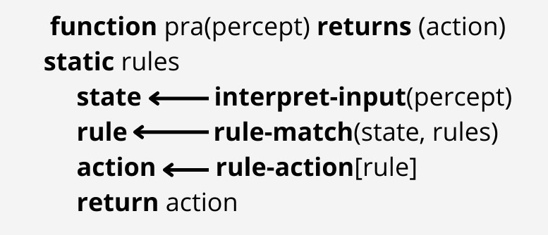
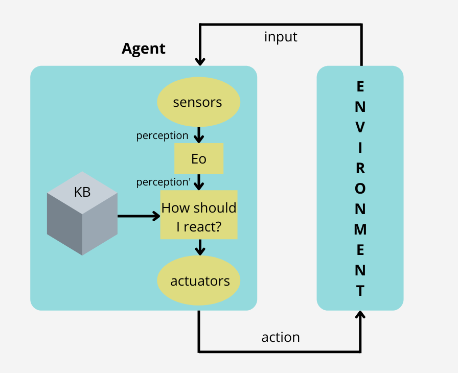
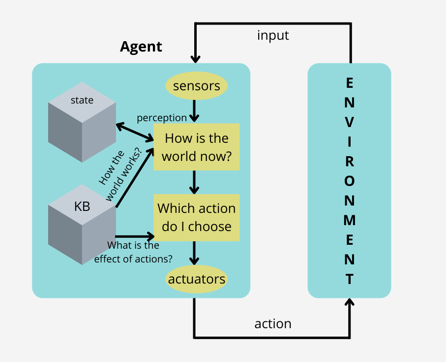
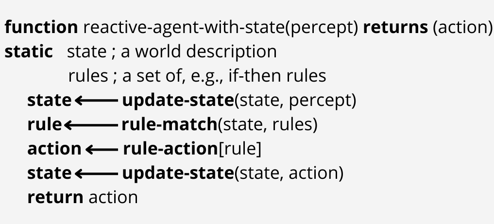
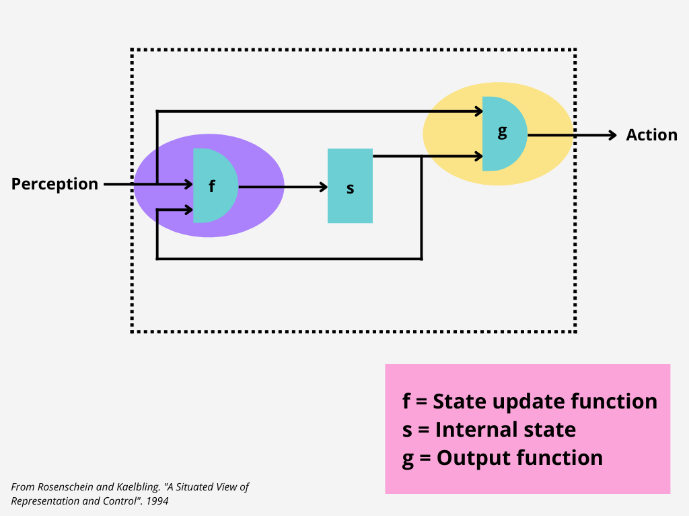
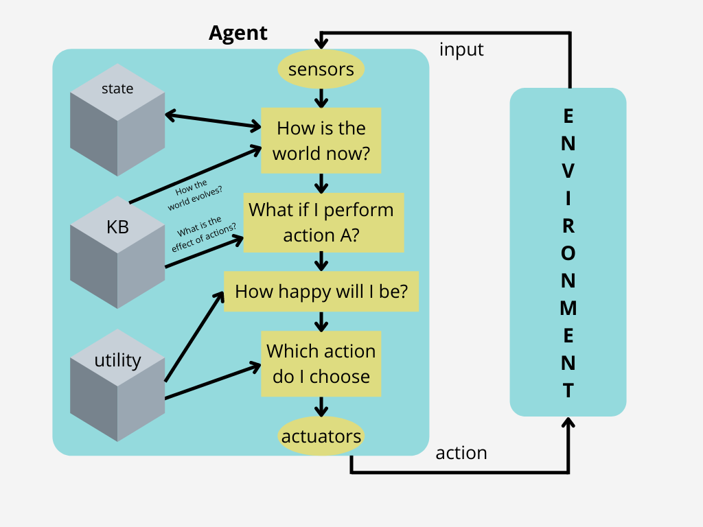
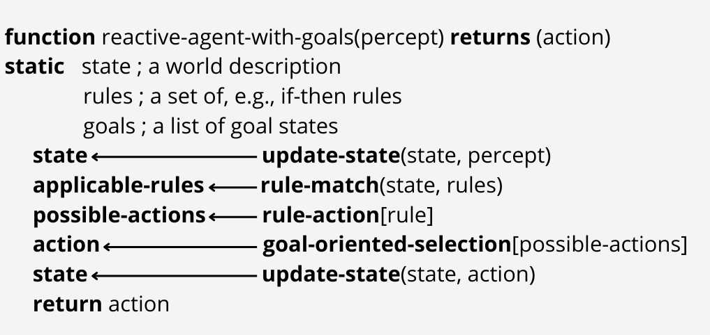
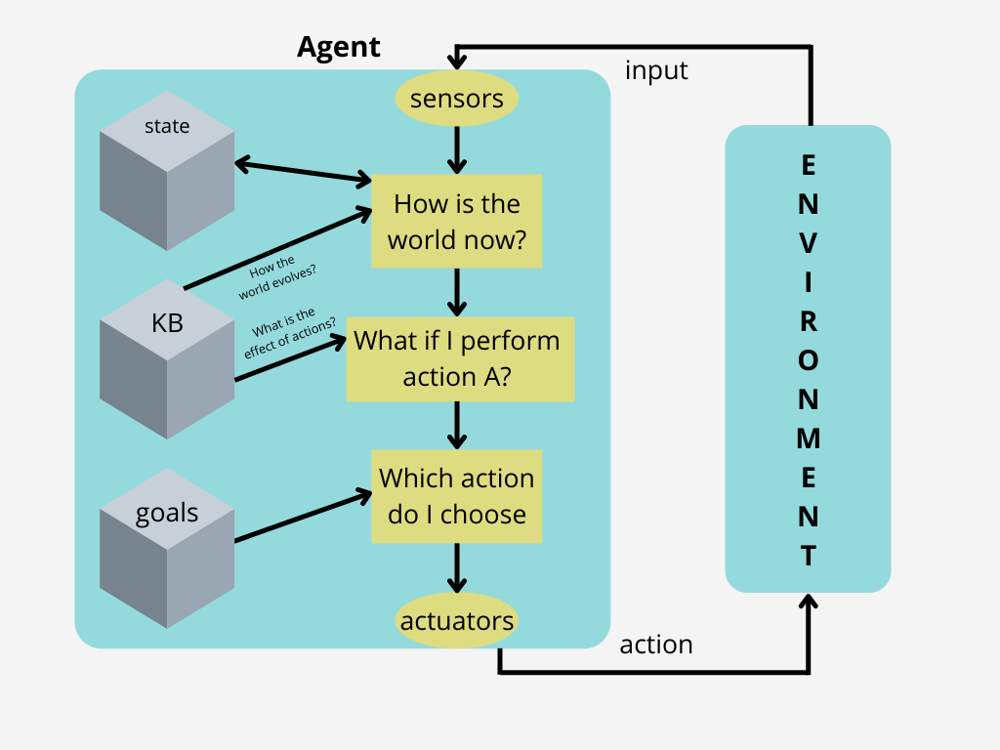
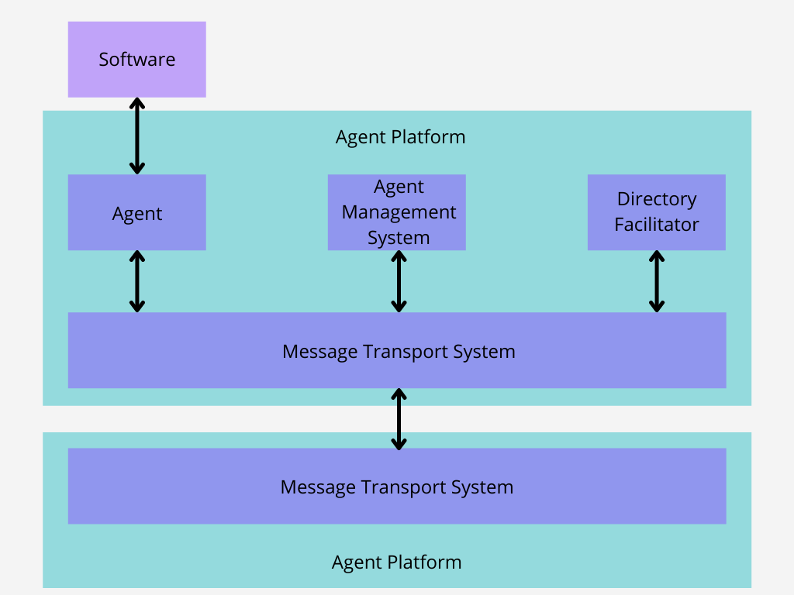

<!DOCTYPE html>

<html lang="en">

<head>
    <meta charset="utf-8">
    <meta http-equiv="X-UA-Compatible" content="IE=edge">
    <meta name="viewport" content="width=device-width, initial-scale=1.0, user-scalable=no">
    <meta name="apple-mobile-web-app-capable" content="yes">
    <meta name="apple-mobile-web-app-status-bar-style" content="black">
    <meta name="mobile-web-app-capable" content="yes">
</head>

<body>
    
<h1 id="Agent-Architectures" data-id="Agent-Architectures"><a class="anchor hidden-xs" href="#Agent-Architectures" title="Agent-Architectures"></a>Agent Architectures</h1><h6 id="tags-SID-teo" data-id="tags-SID-teo"><a class="anchor hidden-xs" href="#tags-SID-teo" title="tags-SID-teo"></a>tags: <code>SID-teo</code></h6>
<ul>
<li><a href="#Abstract-Architecture-for-Agents" title="Abstract Architecture for Agents">Abstract Architecture for Agents</a><ul>
<li><a href="#Reactive-Agents" title="Reactive Agents">Reactive Agents</a></li>
<li><a href="#Purely-Reactive-Agents" title="Purely Reactive Agents">Purely Reactive Agents</a></li>
<li><a href="#Reactive-Agents-with-Internal-State" title="Reactive Agents with Internal State">Reactive Agents with Internal State</a></li>
<li><a href="#AdvantagesDisadvantages-of-Reactive-Agents" title="Advantages/Disadvantages of Reactive Agents">Advantages/Disadvantages of Reactive Agents</a></li>
<li><a href="#Situated-Automata-Components-RULER-and-GAPPS" title="Situated Automata Components: RULER and GAPPS">Situated Automata Components: RULER and GAPPS</a></li>
<li><a href="#Delliberative-Agents-with-expected-utilities" title="Delliberative Agents (with expected utilities)">Delliberative Agents (with expected utilities)</a></li>
<li><a href="#Delliberative-Agents-with-explicit-goals" title="Delliberative Agents (with explicit goals)">Delliberative Agents (with explicit goals)</a></li>
<li><a href="#Agents’-Interactions" title="Agents’ Interactions">Agents’ Interactions</a></li>
</ul>
</li>
<li><a href="#Architectures-for-Multiagent-Systems" title="Architectures for Multiagent Systems">Architectures for Multiagent Systems</a><ul>
<li><a href="#MAS---many-agents-in-the-same-environment" title="MAS - many agents in the same environment">MAS - many agents in the same environment</a></li>
<li><a href="#Agent-Platform" title="Agent Platform">Agent Platform</a></li>
<li><a href="#Components-of-an-Agent-Platform" title="Components of an Agent Platform">Components of an Agent Platform</a></li>
<li><a href="#Communication-methods" title="Communication methods">Communication methods</a></li>
<li><a href="#FIPA-Architecture-for-Agent-Platforms" title="FIPA Architecture for Agent Platforms">FIPA Architecture for Agent Platforms</a></li>
</ul>
</li>
</ul>
</li>
</ul>

<h2 id="Abstract-Architecture-for-Agents" data-id="Abstract-Architecture-for-Agents"><a class="anchor hidden-xs" href="#Abstract-Architecture-for-Agents" title="Abstract-Architecture-for-Agents"></a>Abstract Architecture for Agents</h2><ul>
<li>An <u>agent architecture</u> proposes a particular <strong>methodology for building an autonomous agent.</strong></li>
<li>How the construction of the agent can be decomposed into the construction of a set of <strong>component modules</strong>.
<ul>
<li>How these modules should be made to <strong>interact</strong>.</li>
</ul>
</li>
<li>These two aspects define how the <strong>sensor data</strong> and the <strong>current internal state</strong> of the agent determine the <strong>actions</strong> (effector outputs) and future internal state of the agent.</li>
</ul><h3 id="Reactive-Agents" data-id="Reactive-Agents"><a class="anchor hidden-xs" href="#Reactive-Agents" title="Reactive-Agents"></a>Reactive Agents</h3><ul>
<li>Simple processing units that perceive and react to changes in their environment.</li>
<li>Do not have a symbolic representation of the world and do not use complex symbolic reasoning.</li>
<li>The advocates of reactive agent systems claims that intelligence is not a property of the active entity but it is distributed in the system, and steams as the result of the interaction between the many entities of the distributed structure and the environment.</li>
</ul><h3 id="Purely-Reactive-Agents" data-id="Purely-Reactive-Agents"><a class="anchor hidden-xs" href="#Purely-Reactive-Agents" title="Purely-Reactive-Agents"></a>Purely Reactive Agents</h3><ul>
<li><u>Purely reactive agents</u>: agents that decide what to do without reference to their  history — they <strong>base their decision making entirely on the present</strong>, with no reference at all to the past.</li>
</ul>

<h3 id="Reactive-Agents-with-Internal-State" data-id="Reactive-Agents-with-Internal-State"><a class="anchor hidden-xs" href="#Reactive-Agents-with-Internal-State" title="Reactive-Agents-with-Internal-State"></a>Reactive Agents with Internal State</h3>

<h3 id="AdvantagesDisadvantages-of-Reactive-Agents" data-id="AdvantagesDisadvantages-of-Reactive-Agents"><a class="anchor hidden-xs" href="#AdvantagesDisadvantages-of-Reactive-Agents" title="AdvantagesDisadvantages-of-Reactive-Agents"></a>Advantages/Disadvantages of Reactive Agents</h3><ul>
<li>

<u>Advantages:</u>

<ul>
<li><strong>Simplicity</strong> of individual agents.</li>
<li><strong>Flexibility</strong>, adaptability: Ideal in very dynamic and unpredictable environments.</li>
<li><strong>Computational tractability</strong>: Avoiding complex planning/reasoning. Avoiding continuous model update.</li>
<li><strong>Robustness</strong> against failure: No central planning component (e.g. ant colony).</li>
<li><strong>Elegance</strong>.</li>
</ul>
</li>
<li>

<u>Disadvantages:</u>

<ul>
<li><strong>Need for sufficient information</strong> from the local environment.</li>
<li>Unclear how to incorporate <strong>non-local information</strong>.</li>
<li><strong>No long-term planning</strong> or replanning capabilities.</li>
<li><strong>Applicability is limited</strong>.</li>
<li>Difficult to make reactive agents that <strong>learn</strong>.</li>
<li>Interactions with the environment can have <strong>unpredictable long-term consequences</strong>. Dynamics of interaction can become too complex to understand.</li>
</ul>
</li>
</ul><h3 id="Situated-Automata-Components-RULER-and-GAPPS" data-id="Situated-Automata-Components-RULER-and-GAPPS"><a class="anchor hidden-xs" href="#Situated-Automata-Components-RULER-and-GAPPS" title="Situated-Automata-Components-RULER-and-GAPPS"></a>Situated Automata Components: RULER and GAPPS</h3><ul>
<li>

An agent is specified in terms of two components: <strong>perception</strong> and <strong>action</strong>. Two programs are then used to synthesize agents:

<ul>
<li><strong>RULER</strong> is used to specify the <u>perception component</u> of an agent.</li>
<li><strong>GAPPS</strong> is used to specify the <u>action component</u>.</li>
</ul>
</li>
<li>

<strong><u>RULER</u>:</strong>

<ul>
<li>RULER takes as its input three components: 
<strong>1.</strong> The <strong>semantics</strong> of the agent’s inputs (‘whenever bit 1 is on, it is raining’). 
<strong>2.</strong> A set of <strong>static facts</strong> (‘whenever it is raining, the ground is wet’). 
<strong>3.</strong> A specification of the <strong>state transitions of the world</strong> (‘if the ground is wet, it stays wet until the sun comes out’).</li>
<li>The programmer then specifies the <u>desired semantics for the output</u> (‘if this bit is on, the ground is wet’).</li>
<li>The compiler designs a circuit whose output will have the correct semantics.</li>
</ul>
</li>
<li>

<strong><u>GAPPS</u>:</strong>

<ul>
<li>GAPPS program takes as its input: 
<strong>1.</strong> A set of <strong>goal reduction rules</strong>: Rules that encode information about how goals can be achieved in a given state. 
<strong>2.</strong> A <strong>top level goal</strong>.</li>
<li>Then it generates a program that can be translated into a digital circuit in order to realize the goal.</li>
<li>The generated circuit does not represent or manipulate symbolic expressions; all symbolic manipulation is done at compile time.</li>
</ul>
</li>
</ul><h4 id="From-perception-to-action" data-id="From-perception-to-action"><a class="anchor hidden-xs" href="#From-perception-to-action" title="From-perception-to-action"></a>From perception to action</h4>

<h3 id="Delliberative-Agents-with-expected-utilities" data-id="Delliberative-Agents-with-expected-utilities"><a class="anchor hidden-xs" href="#Delliberative-Agents-with-expected-utilities" title="Delliberative-Agents-with-expected-utilities"></a>Delliberative Agents (with expected utilities)</h3><ul>
<li>We build agents in order to carry out tasks for us. The task must be specified by us… But we want to <strong>tell agents what to do without telling them how to do it</strong>.</li>
<li>One possibility: <strong>associate utilities with individual states</strong> — the task of the agent is then to bring about states that maximize utility.</li>
<li><strong><u>Utility Functions over States</u>:</strong>
<ul>
<li>A task specification is a function <code>u : E → #</code> which associates a <strong>real number with every environment state</strong>.</li>
<li>But what is the value of a <strong>run</strong>…
<ul>
<li>minimum utility of state on run?</li>
<li>maximum utility of state on run?</li>
<li>sum of utilities of states on run?</li>
<li>average?</li>
</ul>
</li>
<li><strong>Disadvantage</strong>: difficult to specify a <strong>long term</strong> view when assigning utilities to individual states (One possibility: a <strong>discount</strong> for states later on).</li>
</ul>
</li>
<li><strong><u>Utilities over Runs</u>:</strong>
<ul>
<li>Another possibility: <code>u : R → #</code> <strong>assigning a utilities to a runs</strong>, instead of assigning them to individual states.</li>
<li>Such an approach takes an inherently <strong>long term view</strong>.</li>
<li>Other variations: incorporate probabilities of different states emerging.</li>
<li><strong>Difficulties</strong> with utility-based approaches:
<ul>
<li>where do the numbers come from?</li>
<li>we (normally?) do not think in terms of utilities!</li>
<li>hard to formulate tasks in these terms.</li>
</ul>
</li>
</ul>
</li>
</ul>

<h3 id="Delliberative-Agents-with-explicit-goals" data-id="Delliberative-Agents-with-explicit-goals"><a class="anchor hidden-xs" href="#Delliberative-Agents-with-explicit-goals" title="Delliberative-Agents-with-explicit-goals"></a>Delliberative Agents (with explicit goals)</h3>
 

<h3 id="Agents’-Interactions" data-id="Agents’-Interactions"><a class="anchor hidden-xs" href="#Agents’-Interactions" title="Agents’-Interactions"></a>Agents’ Interactions</h3><ul>
<li>Interaction between agents is <strong>unavoidable</strong>.
<ul>
<li>To achieve <strong>own goals</strong>.</li>
<li>To manage <strong>interdependencies</strong>.</li>
</ul>
</li>
<li>It should occur at <strong>Knowledge-level</strong>.
<ul>
<li>Which goals?, When?, Who executes what?</li>
</ul>
</li>
<li><strong>Flexibility</strong> to start and to give answers.
<ul>
<li><strong>Asynchronous</strong> communication.</li>
<li>Need for <strong>languages and protocols</strong>.</li>
</ul>
</li>
</ul><blockquote style="border-left-color: rgb(255, 0, 0);">

This implies a radical change in the way programs usually interact.

</blockquote>
<h2 id="Architectures-for-Multiagent-Systems" data-id="Architectures-for-Multiagent-Systems"><a class="anchor hidden-xs" href="#Architectures-for-Multiagent-Systems" title="Architectures-for-Multiagent-Systems"></a>Architectures for Multiagent Systems</h2><h3 id="MAS---many-agents-in-the-same-environment" data-id="MAS---many-agents-in-the-same-environment"><a class="anchor hidden-xs" href="#MAS---many-agents-in-the-same-environment" title="MAS---many-agents-in-the-same-environment"></a>MAS - many agents in the same environment</h3>
Interactions among agents. Interactions for: High-level interactions, Coordination, Communication and Organization.
<ul>
<li><strong>Coordination</strong>
<ul>
<li>Collectively motivated / interested
<ul>
<li>own goals / coalition</li>
</ul>
</li>
<li>Self interested
<ul>
<li>own goals / indifferent</li>
<li>own goals / competition / competing for the same resources</li>
<li>own goals / competition / contradictory goals</li>
</ul>
</li>
</ul>
</li>
<li><strong>Communication</strong>
<ul>
<li>Communication protocol
<ul>
<li>negotiation to reach agreement</li>
</ul>
</li>
<li>Communication language
<ul>
<li>ontologies</li>
</ul>
</li>
</ul>
</li>
<li><strong>Organizational structures</strong>
<ul>
<li>centralized vs decentralized</li>
<li>hierarchical/markets</li>
</ul>
</li>
</ul><h3 id="Agent-Platform" data-id="Agent-Platform"><a class="anchor hidden-xs" href="#Agent-Platform" title="Agent-Platform"></a>Agent Platform</h3><ul>
<li>Agents in a multiagent system tend to interact through a <strong>middleware layer</strong>.</li>
<li>This middleware provides connectivity between agents, solving low-level connectivity issues: Communication methods.</li>
<li>Sometimes this middleware is called <strong>agent platform</strong>.</li>
<li>Agent Platform <strong>tasks</strong>:
<ul>
<li>Suspend temporally an agent execution</li>
<li>Stop an agent execution.</li>
<li>Resume/continue agent execution.</li>
<li>Start an agent.</li>
<li>Platform resource management.</li>
</ul>
</li>
</ul><h3 id="Components-of-an-Agent-Platform" data-id="Components-of-an-Agent-Platform"><a class="anchor hidden-xs" href="#Components-of-an-Agent-Platform" title="Components-of-an-Agent-Platform"></a>Components of an Agent Platform</h3><ul>
<li><strong>Agent</strong>: a program providing a list of services.</li>
<li><strong>Directory Facilitator (DF)</strong> is an agent which provides a Yellow Pages service within the platform <u>(knows the services that agents within the platform provide)</u>.
<ul>
<li><u>register, deregister, modify, search</u></li>
</ul>
</li>
<li><strong>Agent Management System (AMS)</strong> is an agent controlling access and usage of the agent platform. It knows the platform and agents’ <strong>addresses</strong> and provides a White Pages service (knows the routing addresses for agents within and in other platforms).</li>
<li><strong>Message Transport Service (MTS)</strong> is used to enable communication between agents in different platforms.</li>
</ul><h3 id="Communication-methods" data-id="Communication-methods"><a class="anchor hidden-xs" href="#Communication-methods" title="Communication-methods"></a>Communication methods</h3><ul>
<li><strong>Blackboard systems</strong>
<ul>
<li>Agents communicate information through a common data structure, accessible by everybody.</li>
<li>Problem: if there is no middleware to provide some concurrency, it tends to become a bottleneck.</li>
</ul>
</li>
<li><strong>Message passing</strong>
<ul>
<li>Agents communicate directly by means of messages.</li>
<li>The agent platform usually acts as message router.</li>
<li>Common communication language (e.g. <strong>FIPA-ACL</strong>).</li>
<li>Common communication protocols (message format, steps in a communication).</li>
</ul>
</li>
</ul><h3 id="FIPA-Architecture-for-Agent-Platforms" data-id="FIPA-Architecture-for-Agent-Platforms"><a class="anchor hidden-xs" href="#FIPA-Architecture-for-Agent-Platforms" title="FIPA-Architecture-for-Agent-Platforms"></a>FIPA Architecture for Agent Platforms</h3>

    

        

            <a id="tocLabel" class="ui-toc-label btn btn-default" data-toggle="dropdown" href="#" role="button" aria-haspopup="true" aria-expanded="false" title="Table of content">
                <i class="fa fa-bars"></i>
            </a>
            <ul id="ui-toc" class="ui-toc-dropdown dropdown-menu" aria-labelledby="tocLabel">
                
<ul class="nav">

</body>

</html>
