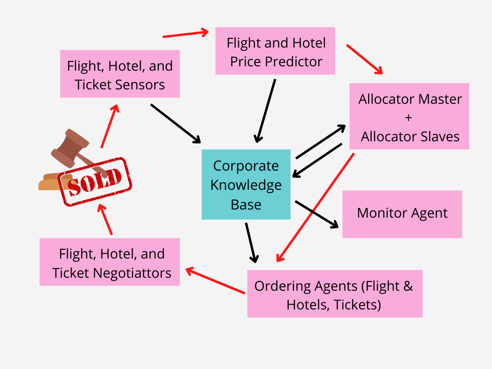

<!DOCTYPE html>

<html lang="en">

<head>
    <meta charset="utf-8">
    <meta http-equiv="X-UA-Compatible" content="IE=edge">
    <meta name="viewport" content="width=device-width, initial-scale=1.0, user-scalable=no">
    <meta name="apple-mobile-web-app-capable" content="yes">
    <meta name="apple-mobile-web-app-status-bar-style" content="black">
    <meta name="mobile-web-app-capable" content="yes">
</head>

<body>
    
<h1 id="Agent-Types-and-Architectures" data-id="Agent-Types-and-Architectures"><a class="anchor hidden-xs" href="#Agent-Types-and-Architectures" title="Agent-Types-and-Architectures"></a>Agent Types and Architectures</h1><h6 id="tags-SID-teo" data-id="tags-SID-teo"><a class="anchor hidden-xs" href="#tags-SID-teo" title="tags-SID-teo"></a>tags: <code>SID-teo</code></h6>
<ul>
<li><a href="#Agent-Properties" title="Agent Properties">Agent Properties</a><ul>
<li><a href="#Agent-Definitions" title="Agent Definitions">Agent Definitions</a></li>
<li><a href="#Autonomy" title="Autonomy">Autonomy</a></li>
<li><a href="#Flexibility" title="Flexibility">Flexibility</a></li>
<li><a href="#Reactivity" title="Reactivity">Reactivity</a></li>
<li><a href="#Proactivness" title="Proactivness">Proactivness</a></li>
<li><a href="#Social-Ability" title="Social Ability">Social Ability</a></li>
<li><a href="#Balancing-Reactive-and-Goal-Oriented-Behaviour" title="Balancing Reactive and Goal-Oriented Behaviour">Balancing Reactive and Goal-Oriented Behaviour</a></li>
<li><a href="#Other" title="Other">Other</a></li>
</ul>
</li>
<li><a href="#Environment-Properties" title="Environment Properties">Environment Properties</a><ul>
<li><a href="#Accessible-vs-Inaccessible" title="Accessible vs. Inaccessible">Accessible vs. Inaccessible</a></li>
<li><a href="#Deterministic-vs-non-Deterministic" title="Deterministic vs. non-Deterministic">Deterministic vs. non-Deterministic</a></li>
<li><a href="#Episodic-vs-non-Episodic" title="Episodic vs. non-Episodic">Episodic vs. non-Episodic</a></li>
<li><a href="#Static-vs-Dynamic" title="Static vs. Dynamic">Static vs. Dynamic</a></li>
<li><a href="#Discrete-vs-Continuous" title="Discrete vs. Continuous">Discrete vs. Continuous</a></li>
</ul>
</li>
<li><a href="#Agent-Types" title="Agent Types">Agent Types</a><ul>
<li><a href="#Physical-Agents" title="Physical Agents">Physical Agents</a></li>
<li><a href="#Software-Agents" title="Software Agents">Software Agents</a></li>
</ul>
</li>
<li><a href="#Abstract-Architecture" title="Abstract Architecture">Abstract Architecture</a></li>
</ul>
</li>
</ul>

<h2 id="Agent-Properties" data-id="Agent-Properties"><a class="anchor hidden-xs" href="#Agent-Properties" title="Agent-Properties"></a>Agent Properties</h2><h3 id="Agent-Definitions" data-id="Agent-Definitions"><a class="anchor hidden-xs" href="#Agent-Definitions" title="Agent-Definitions"></a>Agent Definitions</h3><blockquote>
<ul>
<li>Autonomous agents are computational systems that inhabit some <strong>complex dynamic environment</strong>, sense and <strong>act</strong> autonomously in this environment, and by doing so realize a set of <strong>goals or tasks</strong> for which they are designed.</li>
<li>An autonomous agent is a <strong>system situated within and a part of an environment that senses that environment and acts on it</strong>, over time, in pursuit of its <strong>own agenda</strong> and so as to affect what it senses in the future.</li>
</ul>
</blockquote><h3 id="Autonomy" data-id="Autonomy"><a class="anchor hidden-xs" href="#Autonomy" title="Autonomy"></a>Autonomy</h3><blockquote style="border-left-color: rgb(55, 185, 191);">
<ul>
<li>An agent is a computer system capable of <strong>autonomous</strong> action in some environment in order to meet its design objectives. </li>
</ul>
</blockquote>
Usually the environment is <strong>complex</strong> and <strong>dynamic</strong>, and agents should interact with it in real time. 
<u>Main property</u>: <strong>Autonomy</strong> capable of acting independently, exhibiting control over their <strong>internal state</strong>.

<h3 id="Flexibility" data-id="Flexibility"><a class="anchor hidden-xs" href="#Flexibility" title="Flexibility"></a>Flexibility</h3><blockquote style="border-left-color: rgb(55, 185, 191);">
<ul>
<li>An intelligent agent is a computer system capable of <strong>flexible</strong> autonomous action in some environment. </li>
</ul>
</blockquote>
By flexible, we mean:
<ul>
<li>Reactive (response capability).</li>
<li>Pro-active (taking initiative).</li>
<li>Social (interacting with others).</li>
</ul><h3 id="Reactivity" data-id="Reactivity"><a class="anchor hidden-xs" href="#Reactivity" title="Reactivity"></a>Reactivity</h3><ul>
<li>A <strong><u>reactive system</u></strong> is one that maintains an ongoing interaction with its environment, and responds to changes that occur in it (in time for the response to be useful).</li>
<li>If a program’s environment is guaranteed to be fixed, the program need never worry about its own success or failure – program just executes blindly.
<ul>
<li>Example of fixed environment: compiler.</li>
</ul>
</li>
<li>The real world is not like that: things change, <strong>information is incomplete</strong>. Many (most?) interesting environments are <strong>dynamic</strong>.</li>
<li>Software is hard to build for dynamic domains: program must take into account possibility of failure – <strong>ask itself whether it is worth executing!</strong></li>
</ul><h3 id="Proactivness" data-id="Proactivness"><a class="anchor hidden-xs" href="#Proactivness" title="Proactivness"></a>Proactivness</h3><ul>
<li><u><strong>Pro-activeness</strong></u>: generating and attempting to achieve goals; not driven solely by events; <strong>taking the initiative</strong>.</li>
<li>Reacting to an environment is easy (stimulus → response rules), but we generally want agents to do things for us, hence <strong>goal directed behavior</strong>, <strong>recognizing opportunities.</strong></li>
</ul><h3 id="Social-Ability" data-id="Social-Ability"><a class="anchor hidden-xs" href="#Social-Ability" title="Social-Ability"></a>Social Ability</h3><ul>
<li><strong><u>Social ability</u></strong> in agents is the ability to interact with other agents (and possibly humans) via some kind of <strong>agent-communication language</strong>, and perhaps cooperate with others.</li>
<li>The real world is a <strong>multi-agent</strong> environment: we cannot go around attempting to achieve goals without taking others into account.
<ul>
<li>Some goals can only be achieved with the cooperation of others. Similarly for many computer environments: witness the Internet.</li>
</ul>
</li>
</ul><h3 id="Balancing-Reactive-and-Goal-Oriented-Behaviour" data-id="Balancing-Reactive-and-Goal-Oriented-Behaviour"><a class="anchor hidden-xs" href="#Balancing-Reactive-and-Goal-Oriented-Behaviour" title="Balancing-Reactive-and-Goal-Oriented-Behaviour"></a>Balancing Reactive and Goal-Oriented Behaviour</h3>
These two considerations can be at odds with one another:
<ul>
<li>We want our agents to be reactive, responding to changing conditions in an appropriate (timely) fashion.</li>
<li>We want our agents to systematically work towards longterm goals.</li>
</ul><blockquote style="border-left-color: rgb(255, 0, 0);">

<strong>Reactiveness vs. Deliberation balance</strong> 
Designing an agent that can balance reactiveness and deliberation (reason about long term goals) remains an openresearch problem. 

</blockquote><h3 id="Other" data-id="Other"><a class="anchor hidden-xs" href="#Other" title="Other"></a>Other</h3>
(Desireable, not mandatory)
<ul>
<li><strong>Mobility</strong>: the ability of an agent to move around an electronic network.</li>
<li><strong>Veracity</strong>: an agent will not knowingly communicate false information</li>
<li><strong>Benevolence</strong>: agents do not have conflicting goals, and that every agent will therefore always try to do what is asked of it.</li>
<li><strong>Rationality</strong>: agent will act in order to achieve its goals, and will not act in such a way as to prevent its goals being achieved — at least insofar as its beliefs permit.</li>
<li><strong>Learning/Adaption</strong>: agents improve performance over time.</li>
</ul>
<h2 id="Environment-Properties" data-id="Environment-Properties"><a class="anchor hidden-xs" href="#Environment-Properties" title="Environment-Properties"></a>Environment Properties</h2><h3 id="Accessible-vs-Inaccessible" data-id="Accessible-vs-Inaccessible"><a class="anchor hidden-xs" href="#Accessible-vs-Inaccessible" title="Accessible-vs-Inaccessible"></a>Accessible vs. Inaccessible</h3><ul>
<li>An <strong><u>accessible environment</u></strong> is one in which the agent can obtain complete, accurate, up-to-date information about the environment’s state (the environment is <strong>fully observable</strong>).</li>
<li>Most moderately complex environments (including, for example, the everyday physical world and the Internet) are <strong><u>inaccessible</u></strong> (or <strong>partially observable</strong>).</li>
<li>The more accessible an environment is, the simpler it is to build agents to operate in it.</li>
</ul><h3 id="Deterministic-vs-non-Deterministic" data-id="Deterministic-vs-non-Deterministic"><a class="anchor hidden-xs" href="#Deterministic-vs-non-Deterministic" title="Deterministic-vs-non-Deterministic"></a>Deterministic vs. non-Deterministic</h3><ul>
<li>A <strong><u>deterministic environment</u></strong> is one in which any action has a single guaranteed effect — there is no uncertainty about the state that will result from performing an action.
<ul>
<li>If the environment is deterministic except for the actions of other agents, then the environment can be defined as <strong>strategic</strong>.</li>
</ul>
</li>
<li>The physical world can to all intents and purposes be regarded as <strong><u>non-deterministic (or stochastic)</u></strong> Non-deterministic environments present greater problems for the agent designer.</li>
</ul><h3 id="Episodic-vs-non-Episodic" data-id="Episodic-vs-non-Episodic"><a class="anchor hidden-xs" href="#Episodic-vs-non-Episodic" title="Episodic-vs-non-Episodic"></a>Episodic vs. non-Episodic</h3><ul>
<li>In an <strong><u>episodic environment</u></strong>, the performance of an agent is dependent on a number of discrete episodes, with <strong>no link</strong> between an agent’s performance in different scenarios.
<ul>
<li>Episodic environments are simpler from the agent developer’s perspective because the agent can decide what action to perform based <strong>only on the current episode</strong> — it need not reason about the interactions between this and future episodes.</li>
</ul>
</li>
</ul><h3 id="Static-vs-Dynamic" data-id="Static-vs-Dynamic"><a class="anchor hidden-xs" href="#Static-vs-Dynamic" title="Static-vs-Dynamic"></a>Static vs. Dynamic</h3><ul>
<li>A <strong><u>static environment</u></strong> is one that can be assumed to remain <strong>unchanged</strong> except by the performance of actions by the agent.</li>
<li>A <strong><u>dynamic environment</u></strong> is one that has <strong>other processes operating on it</strong>, and which hence changes in ways beyond the agent’s control. Other processes can interfere with the agent’s actions (as in concurrent systems theory).</li>
<li>The physical world is a highly dynamic environment.</li>
</ul><h3 id="Discrete-vs-Continuous" data-id="Discrete-vs-Continuous"><a class="anchor hidden-xs" href="#Discrete-vs-Continuous" title="Discrete-vs-Continuous"></a>Discrete vs. Continuous</h3><ul>
<li>An <strong><u>environment is discrete</u></strong> if there are a <strong>fixed, finite number of actions and percepts</strong> in it.
<ul>
<li>Discrete environments could <strong>in principle</strong> be handled by a kind of <strong>lookup table</strong>.</li>
</ul>
</li>
<li>Continuous environments have a certain level of mismatch with computer systems.</li>
<li>Russell and Norvig give a chess game as an example of a discrete environment, and taxi driving as an example of a continuous one.</li>
</ul>
<h2 id="Agent-Types" data-id="Agent-Types"><a class="anchor hidden-xs" href="#Agent-Types" title="Agent-Types"></a>Agent Types</h2><h3 id="Physical-Agents" data-id="Physical-Agents"><a class="anchor hidden-xs" href="#Physical-Agents" title="Physical-Agents"></a>Physical Agents</h3><ul>
<li>Physical agents or embodied agents: Interact with real world (sensors, actuators connected to real world).</li>
<li>Problems of perception and action.</li>
<li>Best known example: Robots.</li>
</ul><h3 id="Software-Agents" data-id="Software-Agents"><a class="anchor hidden-xs" href="#Software-Agents" title="Software-Agents"></a>Software Agents</h3><ul>
<li>Software agents’ environment is a virtual one: single machine, intranet, internet.
<ul>
<li>Interact with other software agents, with software modules, services.</li>
<li>Interact with humans through human interfaces.</li>
</ul>
</li>
<li>Types of software agents:
<ul>
<li><strong>Internet agents</strong> search and information extraction/management from Internet.</li>
<li><strong>Collaborative</strong> agents they coordinate with other agents to solve a common task.
<ul>
<li>To solve problems too complex for a single agent.</li>
<li>To solve problems distributed in nature.</li>
<li>To interconnect already existing, heterogeneous systems (→ <strong>Agentification</strong>).</li>
</ul>
</li>
<li><strong>Interface agents</strong> they collaborate with a human user to solve a task, or to act on behalf of the user.</li>
<li><strong>Mobile SW agents</strong> they can move from one computer to another.</li>
</ul>
</li>
</ul>
<h2 id="Abstract-Architecture" data-id="Abstract-Architecture"><a class="anchor hidden-xs" href="#Abstract-Architecture" title="Abstract-Architecture"></a>Abstract Architecture</h2><ul>
<li>Internal architecture:
<ul>
<li>Purely Reactive Agents (with no internal state).</li>
<li>Reactive Agents with internal state.</li>
<li>Delliberative Agents (goal-oriented behaviour).</li>
<li>Hybrid Agents (combine reactive and delliberative behaviour).</li>
</ul>
</li>
<li><em>Example</em>: A Multi-Agent System (Trading Agent Competition)!</li>
</ul>

    

        

            <a id="tocLabel" class="ui-toc-label btn btn-default" data-toggle="dropdown" href="#" role="button" aria-haspopup="true" aria-expanded="false" title="Table of content">
                <i class="fa fa-bars"></i>
            </a>
            <ul id="ui-toc" class="ui-toc-dropdown dropdown-menu" aria-labelledby="tocLabel">
                
<ul class="nav">

</html>
