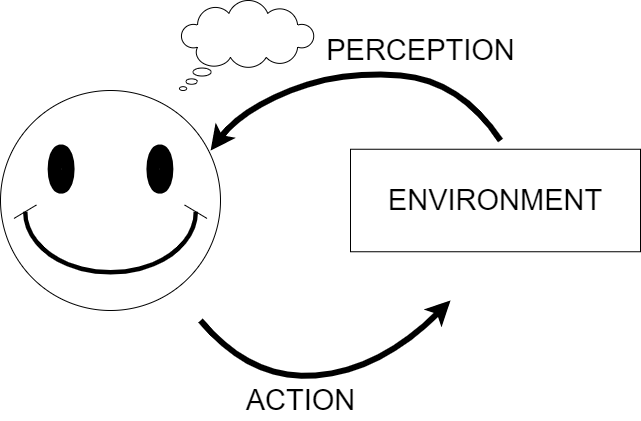
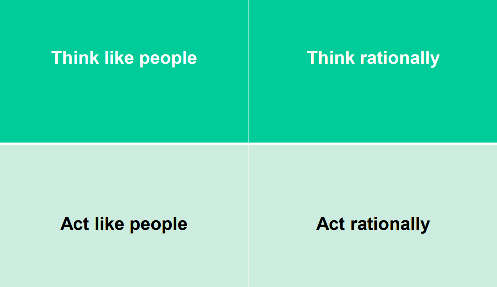

<!DOCTYPE html>

<html lang="en">

<head>
    <meta charset="utf-8">
    <meta http-equiv="X-UA-Compatible" content="IE=edge">
    <meta name="viewport" content="width=device-width, initial-scale=1.0, user-scalable=no">
    <meta name="apple-mobile-web-app-capable" content="yes">
    <meta name="apple-mobile-web-app-status-bar-style" content="black">
    <meta name="mobile-web-app-capable" content="yes">
</head>

<body>
    
<h1 id="Introduction-to-Distributed-Intelligent-Agent-Systems" data-id="Introduction-to-Distributed-Intelligent-Agent-Systems"><a class="anchor hidden-xs" href="#Introduction-to-Distributed-Intelligent-Agent-Systems" title="Introduction-to-Distributed-Intelligent-Agent-Systems"></a>Introduction to Distributed Intelligent Agent Systems</h1><h6 id="tags-SID-teo" data-id="tags-SID-teo"><a class="anchor hidden-xs" href="#tags-SID-teo" title="tags-SID-teo"></a>tags: <code>SID-teo</code></h6>
<ul>
<li><a href="#Introduction-to-Distributed-Intelligent-Agent-Systems" title="Introduction to Distributed Intelligent Agent Systems">Introduction to Distributed Intelligent Agent Systems</a><ul>
<li><a href="#Artificial-Intelligence" title="Artificial Intelligence">Artificial Intelligence</a></li>
<li><a href="#Cognitive-Architectures-I" title="Cognitive Architectures I">Cognitive Architectures I</a></li>
<li><a href="#Intelligent-Agent" title="Intelligent Agent">Intelligent Agent</a></li>
<li><a href="#Cognitive-AI-Paradigms" title="Cognitive AI Paradigms">Cognitive AI Paradigms</a></li>
<li><a href="#Cognitive-AI-Fundations" title="Cognitive AI Fundations">Cognitive AI Fundations</a><ul>
<li><a href="#George-Herbert-Mead-1863-1931-Mind-Self-and-Society" title="George Herbert Mead (1863-1931) Mind, Self, and Society">George Herbert Mead (1863-1931) Mind, Self, and Society</a></li>
</ul>
</li>
<li><a href="#MIND" title="MIND">MIND</a><ul>
<li><a href="#Analogy-An-ants-society" title="Analogy: An ants society">Analogy: An ants society</a></li>
<li><a href="#Stochastic-Neural-Analog-Reinforcement-Computer-SNARC-1951" title="Stochastic Neural Analog Reinforcement Computer (SNARC, 1951)">Stochastic Neural Analog Reinforcement Computer (SNARC, 1951)</a></li>
<li><a href="#Marvin-Minsky-The-Society-of-Mind" title="Marvin Minsky, The Society of Mind">Marvin Minsky, The Society of Mind</a></li>
</ul>
</li>
<li><a href="#Which-Kind-of-Cognitive-Architectures-are-we-Looking-for" title="Which Kind of Cognitive Architectures are we Looking for?">Which Kind of Cognitive Architectures are we Looking for?</a></li>
<li><a href="#Nature-of-the-Brain" title="Nature of the Brain">Nature of the Brain</a></li>
<li><a href="#Architectures-for-Reactive-Systems" title="Architectures for Reactive Systems">Architectures for Reactive Systems</a></li>
<li><a href="#Cognitive-Architectures-II" title="Cognitive Architectures II">Cognitive Architectures II</a><ul>
<li><a href="#Parameters" title="Parameters">Parameters</a></li>
<li><a href="#Open-issues" title="Open issues">Open issues</a></li>
<li><a href="#Functional-aspects" title="Functional aspects">Functional aspects</a></li>
</ul>
</li>
<li><a href="#Rational-Decisions" title="Rational Decisions">Rational Decisions</a></li>
</ul>
</li>
</ul>

<h2 id="Artificial-Intelligence" data-id="Artificial-Intelligence"><a class="anchor hidden-xs" href="#Artificial-Intelligence" title="Artificial-Intelligence"></a>Artificial Intelligence</h2><ul>
<li>

Too many definitions:

<blockquote style="border-left-color: rgb(55, 185, 191);">

The theory and development of computer systems able to perform tasks normally requiring human intelligence, such as visual perception, speech recognition, decision-making, and translation between languages. 

</blockquote>
<blockquote style="border-left-color: rgb(55, 185, 191);">

Artificial intelligence is the ability of a digital computer or computer-controlled robot to perform tasks commonly associated with intelligent beings.  The term is frequently applied to the project of developing systems endowed with the intellectual processes characteristic of humans, such as the ability to reason, discover meaning, generalize, or learn from past experience. 

</blockquote>
<blockquote style="border-left-color: rgb(55, 185, 191);">

“Artificial intelligence (AI) refers to systems that display intelligent behaviour by analysing their environment and taking actions – with some degree of autonomy – to achieve specific goals." <em>-European Commission’s Communication on AI</em> 

</blockquote>
<blockquote style="border-left-color: rgb(55, 185, 191);">

Artificial intelligence (AI) systems are software (and possibly also hardware) systems designed by humans that, given a complex goal, <strong>act in the physical or digital dimension by perceiving their environment through data acquisition</strong>, interpreting the collected structured or unstructured data, reasoning on the knowledge, or processing the information, derived from this data and <strong>deciding the best action(s) to take to achieve the given goal.</strong> AI systems can either use <strong>symbolic rules or learn a numeric model</strong>, and they can also adapt their behaviour by analysing how the environment is affected by their previous actions. <em>-(HLEG-AI)</em> 

</blockquote>
</li>
</ul>
<h2 id="Cognitive-Architectures-I" data-id="Cognitive-Architectures-I"><a class="anchor hidden-xs" href="#Cognitive-Architectures-I" title="Cognitive-Architectures-I"></a>Cognitive Architectures I</h2><ul>
<li>In this course we aim to have a <strong>holistic view</strong> of Artificial Intelligence: its methods, techniques, and how to combine them into intelligent systems.</li>
<li>But… what is an <strong>intelligent system</strong>?
<ul>
<li>One way to characterize the behaviour we <strong>think</strong> as <em><strong>intelligence</strong></em> is through the study of the architectures providing such behaviour.</li>
</ul>
</li>
<li>We call <u><strong>Cognitive Architectures</strong></u> the ones that use <strong>symbols</strong> to represent the environment.
<ul>
<li><u>Architectures</u> are described by the description of their foundations and the methods used to achieve an <em><strong>intelligent behaviour</strong></em>.</li>
<li>Cognitive architectures are based on computational entities, but this does not imply that intelligence should come always from the computer.</li>
<li>A metaphor typically used in Cognitive Architectures to cover both human and machine intelligence is the one of the <em><strong>intelligent agent</strong></em>.</li>
</ul>
</li>
</ul>
<h2 id="Intelligent-Agent" data-id="Intelligent-Agent"><a class="anchor hidden-xs" href="#Intelligent-Agent" title="Intelligent-Agent"></a>Intelligent Agent</h2><ul>
<li><u>An agent is a computer system capable of autonomous action in some environment in order to meet its design objectives.</u></li>
<li>An agent should be able to perceive and act in the environment.</li>
<li>Usually the environment is <em><strong>complex</strong></em> and <em><strong>dynamic</strong></em>, and agents should interact with it in real time.</li>
</ul>

<h2 id="Cognitive-AI-Paradigms" data-id="Cognitive-AI-Paradigms"><a class="anchor hidden-xs" href="#Cognitive-AI-Paradigms" title="Cognitive-AI-Paradigms"></a>Cognitive AI Paradigms</h2><ul>
<li>In AI, paradigmas can be characterized by the metaphor used to model intelligence:
<ul>
<li>Logics</li>
<li>Search in a State Space</li>
<li>Knowledge-Based (rules, patterns, experiences)</li>
<li>Evolutionary</li>
<li>Social</li>
</ul>
</li>
</ul>
<h2 id="Cognitive-AI-Fundations" data-id="Cognitive-AI-Fundations"><a class="anchor hidden-xs" href="#Cognitive-AI-Fundations" title="Cognitive-AI-Fundations"></a>Cognitive AI Fundations</h2><ul>
<li>PHILOSOPHY
<ul>
<li>Can rules be used to extract valid conclusions? How mind emerges from the physical brain? Where does Knowledge come from? How can Knowledge lead to action?</li>
</ul>
</li>
<li>MATHEMATICS/LOGICS
<ul>
<li>Which are the formal rules to extract valid conclusions? Which things are computable? How to reason with Knowledge that is uncertain and/or vague and/or incomplete?</li>
</ul>
</li>
<li>NEUROSCIENCES
<ul>
<li>How is information processed by the brain?</li>
</ul>
</li>
<li>PSICOLOGY
<ul>
<li>How do animals and humans think and act?</li>
</ul>
</li>
<li>SOCIOLOGY/ETOLOGY/ECONOMICS
<ul>
<li>How collective (social/organizational) behaviour can be generated from individual (animal/human) behaviour?</li>
</ul>
</li>
<li>CONTROL THEORY
<ul>
<li>How can self-controlled artifacts behave/act?</li>
</ul>
</li>
</ul><h3 id="George-Herbert-Mead-1863-1931-Mind-Self-and-Society" data-id="George-Herbert-Mead-1863-1931-Mind-Self-and-Society"><a class="anchor hidden-xs" href="#George-Herbert-Mead-1863-1931-Mind-Self-and-Society" title="George-Herbert-Mead-1863-1931-Mind-Self-and-Society"></a>George Herbert Mead (1863-1931) Mind, Self, and Society</h3><blockquote style="border-left-color: rgb(55, 185, 191);">
<ul>
<li>The self is an object to itself.</li>
<li>The self is a social structure.</li>
<li>Self arises from social experience.</li>
<li>Self arises from language and interaction with others.</li>
<li>The conversation of gestures is the beginning of communication.</li>
<li>The inner conversation is the beginning of self (selfrealization). </li>
</ul>
</blockquote><blockquote style="border-left-color: rgb(55, 185, 191);">
<ul>
<li>One inevitably seeks communication with others.</li>
<li>Communication requires planning.</li>
<li><strong>Thinking</strong> becomes preparatory to social action.</li>
<li>The process of <strong>thinking is an inner conversation.</strong></li>
<li><u>Symbols are essential for communication and the development of the self.</u> </li>
</ul>
</blockquote><blockquote style="border-left-color: rgb(55, 185, 191);">
<ul>
<li>The <strong>complete self</strong> reflects the unity of the social process; and each of the elementary selves reflects the complete social process of self-reflection and interaction with others.</li>
<li>Stages of the development of the self:
<ol>
<li><u>Play stage</u>: dyatic relationships.</li>
<li><u>Game stage</u>: multiple relationships.</li>
</ol>
</li>
<li><strong>Game playing</strong> requires a realization of the generalized other: assuming the statuses and roles of all involved. </li>
</ul>
</blockquote><blockquote style="border-left-color: rgb(55, 185, 191);">
<ul>
<li>The self-conscious individual assumes the organized social attitudes of the social group.</li>
<li>The self is not so much a substance as a process, continually changing and adapting to social processes.</li>
<li>The <strong>“me”</strong> is the accumulated awareness of "<em>the generalized other.</em>”</li>
<li>The <strong>“I”</strong> is the more personal. It is the reflector or observer.</li>
<li><strong>The human mind arises solely through social experience.</strong> It represents the thinking process of internalized communication. </li>
</ul>
</blockquote>
<h2 id="MIND" data-id="MIND"><a class="anchor hidden-xs" href="#MIND" title="MIND"></a>MIND</h2><ul>
<li>Motivation:
<ul>
<li>What is human mind and how does it work? How do we recognize objects and scenes? How do we use words and languages? How do we achieve goals? How do we learn ? How does common sense work?</li>
</ul>
</li>
</ul><h3 id="Analogy-An-ants-society" data-id="Analogy-An-ants-society"><a class="anchor hidden-xs" href="#Analogy-An-ants-society" title="Analogy-An-ants-society"></a>Analogy: An ants society</h3><ul>
<li>An individual ant is not very bright, but ants in a colony, operating as a collective, do remarkable things.</li>
</ul><blockquote style="border-left-color: rgb(55, 185, 191);">

A single neuron in the human brain can respond only to what the neurons connected to it are doing, but all of them together can be Albert Einstein. <em>Deborah M. Gordon (Stanford University)</em> 

</blockquote><ul>
<li>Some social systems in Nature can present an <em>intelligent collective behaviour</em> although they are composed by simple individuals.</li>
<li>The intelligent solutions to problems naturally emerge from the self-organization and <em>communication</em> of these individuals.
<ul>
<li>Carrying large items, forming bridges, finding the shortest routes from the nest to a food source, prioritizing food sources based on their distance and ease of access…</li>
</ul>
</li>
<li>Individual ants are simple insects with <em><strong>limited</strong></em> memory and capable of performing <em><strong>simple</strong></em> actions. However, an ant colony expresses a <em><strong>complex</strong></em> collective behaviour.
<ul>
<li>How do they know which task to perform? How can they manage to find the shortest path (Goal)? How did the Ants communicate with each other? How do they form such huge colonies?</li>
</ul>
</li>
<li>Ants have dealt with the same kind of questions which we have set out with.</li>
</ul><h3 id="Stochastic-Neural-Analog-Reinforcement-Computer-SNARC-1951" data-id="Stochastic-Neural-Analog-Reinforcement-Computer-SNARC-1951"><a class="anchor hidden-xs" href="#Stochastic-Neural-Analog-Reinforcement-Computer-SNARC-1951" title="Stochastic-Neural-Analog-Reinforcement-Computer-SNARC-1951"></a>Stochastic Neural Analog Reinforcement Computer (SNARC, 1951)</h3><ul>
<li><u>Key idea</u>: producing machines which could learn by providing them with memory neurones connected to synapses; the machine would also have to possess past memory in order to function efficiently when faced with different situations.</li>
</ul><h3 id="Marvin-Minsky-The-Society-of-Mind" data-id="Marvin-Minsky-The-Society-of-Mind"><a class="anchor hidden-xs" href="#Marvin-Minsky-The-Society-of-Mind" title="Marvin-Minsky-The-Society-of-Mind"></a>Marvin Minsky, The Society of Mind</h3><blockquote style="border-left-color: rgb(55, 185, 191);">
<ul>
<li><u>Background</u>: The functions performed by the brain are the products of the work of thousands of different, specialized sub-systems, the intricate product of hundreds of millions of years of biological evolution. We cannot hope to understand such an organization by emulating the techniques of those particle physicists who search for the simplest possible unifying conceptions. <strong>Constructing a mind is simply a different kind of problem</strong>—of how to synthesize organizational systems that can support a large enough diversity of different schemes, yet enable them to work together to exploit one another’s abilities. <em>[Minsky, M.: Logical vs. Analogical or Symbolic vs. Connectionist or Neat vs. Scruffy.]</em></li>
<li><u>Aim</u>: to create a theory of human cognition. </li>
</ul>
</blockquote><blockquote style="border-left-color: rgb(55, 185, 191);">
<ul>
<li><u>Approach</u>: A Cognitive Architecture composed by thousands of individual agents.</li>
<li><u>Idea</u>: Human intelligence is built layer by layer from the interactions of simple parts called <strong>agents</strong>, which are themselves mindless.
<ul>
<li>Theory covers processes <strong>such as language, memory, learning, consciousness, the sense of self, and free-will.</strong></li>
<li>Very flexible. Based on integration. Scalable.</li>
</ul>
</li>
<li><u>Point of view</u>: constructivist and organicist.</li>
<li><u>Technical perspective</u>: Parallelism, different types of Knowledge bases, compatibility between the symbolic and sub-symbolic levels. </li>
</ul>
</blockquote><blockquote style="border-left-color: rgb(55, 185, 191);">
<ul>
<li><u>The revolutionary proposal of The Society of Mind:</u>
<ul>
<li>It takes into account and tries to explain cognitive development.</li>
<li>It takes into account evolution.</li>
<li>It takes into account emotions.</li>
<li>Flexible behaviour depending on the environment.</li>
<li>Exhibiting some rationality. </li>
</ul>
</li>
</ul>
</blockquote>
<h2 id="Which-Kind-of-Cognitive-Architectures-are-we-Looking-for" data-id="Which-Kind-of-Cognitive-Architectures-are-we-Looking-for"><a class="anchor hidden-xs" href="#Which-Kind-of-Cognitive-Architectures-are-we-Looking-for" title="Which-Kind-of-Cognitive-Architectures-are-we-Looking-for"></a>Which Kind of Cognitive Architectures are we Looking for?</h2><ul>
<li>Capable to operate in rich and complex environments.</li>
<li>Capable of using symbols and abstractions.</li>
<li>Use of natural and artificial languages.</li>
<li>Learn from the environment and the experience.</li>
<li>Get capabilities during execution time (adaptation).</li>
<li>Operate in an autonomous way, but being social.</li>
<li>Be self-conscious.</li>
<li>Be built from (artificial) neurons.</li>
<li>Emerge from evolution.</li>
</ul>
<h2 id="Nature-of-the-Brain" data-id="Nature-of-the-Brain"><a class="anchor hidden-xs" href="#Nature-of-the-Brain" title="Nature-of-the-Brain"></a>Nature of the Brain</h2><ul>
<li>Human minds are not perfect decision-makers, but by and large they are very good.</li>
<li>Brains are not as modular as software.</li>
<li><strong>Brains may are to <em>intelligence</em> as wings to <em>flying</em></strong>. Mimesis is not always the best idea.</li>
<li>Lessons learned: memory and simulation (planning) are good to decision making.</li>
</ul>
<h2 id="Architectures-for-Reactive-Systems" data-id="Architectures-for-Reactive-Systems"><a class="anchor hidden-xs" href="#Architectures-for-Reactive-Systems" title="Architectures-for-Reactive-Systems"></a>Architectures for Reactive Systems</h2><ul>
<li>These systems make decision at run time based on limited information and simple situation action rules.</li>
<li>These architectures were often called behaviour based, situated or reactive.</li>
<li><strong>Brooks with Subsumption architecture denied the need for symbolic representation of the world, instead the systems make their decisions based on the inputs.</strong></li>
<li>The decision of reactive architectures are partly guided by Simon’s hypothesis states that that the <em>complexity of the behaviour of the system can be a reflection of the complexity of the environment rather than the reflection of the system’s complex internal design.</em></li>
</ul><blockquote style="border-left-color: rgb(255, 191, 0);">

<strong><em>NOTE:</em></strong>  Cognitive architectures and neural networks are not the same. 

</blockquote>
<h2 id="Cognitive-Architectures-II" data-id="Cognitive-Architectures-II"><a class="anchor hidden-xs" href="#Cognitive-Architectures-II" title="Cognitive-Architectures-II"></a>Cognitive Architectures II</h2><h3 id="Parameters" data-id="Parameters"><a class="anchor hidden-xs" href="#Parameters" title="Parameters"></a>Parameters</h3><ul>
<li>Generality</li>
<li>Versatility</li>
<li>Rationality</li>
<li>Learning</li>
<li>Psychological Validation</li>
<li>Applicability</li>
<li>Scalability</li>
<li>Reactivity</li>
<li>Efficiency</li>
</ul><h3 id="Open-issues" data-id="Open-issues"><a class="anchor hidden-xs" href="#Open-issues" title="Open-issues"></a>Open issues</h3><ul>
<li>Which is the best of all Architectures?</li>
<li>Will we ever get complete architectures?</li>
<li>Which kind of intelligence will we get?</li>
<li>How can agents solve problems?</li>
</ul><h3 id="Functional-aspects" data-id="Functional-aspects"><a class="anchor hidden-xs" href="#Functional-aspects" title="Functional-aspects"></a>Functional aspects</h3><ul>
<li>Engineering methodology (how to develop them).</li>
<li>Capability to tackle a wide range of complex tasks.</li>
<li>Efficiency when acting on the environment.</li>
<li>Autonomy.</li>
</ul>
<h2 id="Rational-Decisions" data-id="Rational-Decisions"><a class="anchor hidden-xs" href="#Rational-Decisions" title="Rational-Decisions"></a>Rational Decisions</h2><ul>
<li><strong>Rational</strong>: maximally achieving pre-defined goals.</li>
<li>Rationality only concerns what decisions are made.</li>
<li><strong>Goals</strong> are expressed in terms of utility (of outcomes).</li>
</ul><figure>

<figcaption><b>What kind of AI?</b></figcaption>
</figure><blockquote>

<em>I think the big problem is that we’re not smart enough to understand which of the problems we’re facing are good enough. Therefore, we have to build super intelligent machines like HAL.</em> -Marvin Minsky

</blockquote>

    
</body>

</html>
