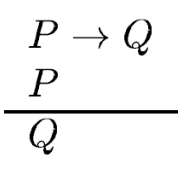

# Motivation & Several Views of Ontologies

[//]: # (Poner aqui link al pdf/quizas no es muy legal colgar las transpas de otros)

###### tags: `SID-teo`

[ToC]

---

[//]: #(3,25,26,27,32)
## Motivation 

* Mutual understanding:
    * Translation between representation languages.
    * Share the language’s semantic content.
* <u>Three components in communication</u>:
    * **Interaction protocol**: How are conversations/dialogues structured?
    * **Communication Language**: What does each message means?
    * **Transport protocol**: How messages are actually sent and received by agents?

[//]: #(4,)
### Communication and Knowledge Level
Agents can be considered as (virtual) Knowledge Bases.
* 3 representation levels:
    * A language/formalism to represent domain knowledge: **Ontology**.
    * A language to express propositions (to exchange knowledge): **Content language** (for messages).
    * A language to express attitudes for those propositions: **Agent Communication Language** (for languages).

### Ontologies in Knowledge Engineering 
* To enable human experts to **model and analyse their problem solving expertise**; this expertise analysis should be suitable to feed into the conceptual knowledge system design process.
* To enable and support reuse of previous constructed knowledge bases. Reuse meaning **knowledge decompilation**.
* Ontologies **divide domain knowledge from operational knowledge**:
    * Allows to independently develop the techniques and algorithms to solve a problem from the concrete knowledge about the problem.
* They allow **analysis over domain knowledge**:
    * Once we have a knowledge specification, it can be analysed by means of formal methods (correctness, completeness …).

### Ontologies in Distributed AI 
* To allow **sharing an interpretation** of informationstructure between people/agents:
    * By creating an ontology about a domain, agents can understand each other (unambiguously) and know what the other means with each message.
* To allow **knowledge reuse**:
    * Create a domain description which can be used by other applications which should use/share knowledge about that domain.
* To make explicit **the interpretations about the domain**:
    * Interpretations about concepts, predicates… can be compared. If conflicts arise, a common interpretation can be agreed upon.

### Why Ontologies?

* To share **common understanding** of the structure of information among people or software agents.
* To enable **reuse of domain knowledge**.
* To make **domain assumptions explicit**.
* To **separate domain knowledge from the operational knowledge**.
* To **analyze domain knowledge**.

---
[//]: #(6,7,8)
## Ontology & Epistemology

* **Ontology**: the question of <u>what reality is like, the basic elements it contains.</u>
* **Epistemology**: <u>study of the criteria by which we can know what does and does not constitute warranted, or scientific, knowledge.</u>
* **Methodology**: theories of gathering knowledge, <u>how we can know what we are able to know?</u>
* The way we think the world is (**ontology**) influences: what we think can be known about it (**epistemology**); how we think it can be investigated (**methodology and research techniques**);

> If it looks like a duck, swims like a duck, and quacks like a duck, then it probably is a duck.
> 

[//]: #(9,10)

---
## Origins

* Ontology development is directly related to Philosophy.
* **Aristotle** coined the term **Category** as the word to describe the different classes things in the world can be divided into.
* Aristotle’s first system of classification is of beings (τὰ ὄντα). The division proceeds by way of two concepts:
    * **said-of**
        * Beings that are <u>said-of others are **universals**</u>, while those that are <u>not said-of others are **particulars**</u>.
    * **present-in**
        * Beings that are <u>present-in others are **accidental**</u>, while those that are <u>not present-in others are **non-accidental**</u>.
    * <u>Non-accidental beings that are universals</u> are most naturally described as **essential**.
* The term Ontology is quite modern (XIX century). It comes from Greek Ontos (of being/to be) and Logos (word).
* Its use started to differentiate studies about the categories of being from those categories in biology.
    * In fact categorization is a common task in several science areas (Philosophy, Biology, Medicine, Linguistics...)

---

[//]: #(5,11,12)
## Definitions

* What is an ontology?
    > * Webster:
    Main Entry: on·tol·o·gy
    Pronunciation: än-'tä-l&-jE
    Function: noun
    Etymology: New Latin ontologia, from ont- + -logia -logy
    Date: circa 1721
    **1** : a branch of metaphysics concerned with the nature and relations of being;
    **2** : a particular theory about the nature of being or the kinds of existents.
    >
    >
    > * “An ontology defines the basic terms and relations comprising the vocabulary of a topic area, as well as the rules for combining terms and relations to define extensions to the vocabulary” [Neches 91]
    >
    >
    > * “An Ontology is an explicit specification of a conceptualization” [Gruber 93]
    >
    >
    > * […] an ontology is a description (like a formal specification of a program) of the concepts and relationships that can exist for an agent or a community of agents.
    >
    >
    > * http://www-ksl.stanford.edu/kst/what-is-an-ontology.html
* Ontology aims to study the **categories that exist in a given domain**. The result of this study is an **ontology**.
    * A catalogue of the different kinds of objects that we assume as existing in a given domain **D**, from the perspective of someone that uses a language **L** in order to talk about **D**.
* Elements in ontologies represent **predicates**, **constants**, **concepts** and **relationships**.
* An ontology can be seen as the vocabulary that agents need to use in order to talk about a given domain.

### Ontologies: some assumptions

* **Absolute truth** might never be found.
* Data, **evidence** and rational considerations shape knowledge.
* Research is a process of **making claims and then testing, refining or abandoning** some of them for other claims more strongly warranted.
* Research seeks to develop relevant, true statements that can serve to explain the situation that is of concern or that describes the causal relationship of interest.
* Researchers must examine their methods and conclusions and control or **limit bias**.

### Ontologies vs. data models

**No strict line** in between, but **ontologies** are:
* More general.
* More reusable.
* Intended for multiple purposes, goals, and users.
* More easily shareable.
* Take stand on semantics of concepts (as opposed to mere structure and integrity).

---

[//]: #(18,19,20)
## Ontologies in Logics

* The <u>ability to produce deductions</u> from the information represented in an ontology is given by a **Logic**.
* Logic by itself tends to be neutral with respect to meaning:
    * The below reasoning refers to nothing unless we give meaning to the atoms (P = “it rains”, Q = “I’m wet”).
    * 
* When we combine a logic with an ontology, the ontology provides the logical formalism with the capability to express meanings with its statements.
* This is specially useful in higher-level logics:
    * **First-Order Logic**:
        * `citizen(x) → human(x)`
        * What do `citizen` and `human` mean?
    * **Dynamic Logic**:
        * `[order(x,item,t)] ack-order-received(x,item)`
        * What is the meaning of the `order` action?
        * What do the `ack-order-received` predicate means?
    * **Deontic Logic:**
        * `If won(x, auct, item, pr) → O(pay(x,item,pr))`
        * What is the meaning of the `won` predicate?
        * What is the meaning of its second parameter?
        * What does `pay` mean?
        * Is there more than one way to pay?

---

[//]: #(20,21,22,23,24)
## Description Logic

Las **lógicas de descripción**, también llamadas lógicas descriptivas son una familia de lenguajes de representación del conocimiento que pueden ser usados para representar conocimiento terminológico de un dominio de aplicación de una forma estructurada y formalmente bien comprendida. **Many DLs are more expressive than propositional logic but less expressive than first-order logic.**

Description Logics **overcome the ambiguities of early semantic networks and frames.**
* First realized in the system KL-One [Brachman and Schmolze, 1985].
* Well-studied and decidable (most DL languages).
* Tight coupling between theory and practice.

### TBox and ABox

* **TBox: terminology**: The vocabulary of an application domain:
    * <u>Concepts</u>: sets of individuals.
    * <u>Roles</u>: binary relationships between individuals.
    * <u>Examples</u>:
        * Concepts: Person, Female, Mother.
        * Role: hasChild, meaning that some person is the child of some other.
* **ABox: assertions**: About named individuals in terms of this vocabulary.
    * <u>Examples</u>:
        * Elizabeth and Charles are Persons. We write this as Person(Elizabeth), and Person(Charles).
        * Individuals, like “myCar”, have attributes, like “color”, and those attributes have values, like “red”. When this happens we say that red is the colorOf attribute of myCar. We write this as colorOf(myCar, red).

**Knowledge Base = TBox + ABox**

### Architecture of a DL System

---

## “Ontological” extension

* **In Information Science**:
    “An ontology is a description (like a formal specification of a program) of the concepts and relationships that <u>can exist</u> for an agent or a community of agents.” (Tom Gruber)
* **In Philosophy**:
    “Ontology is the science of <u>what is</u>, of the kinds and structures of objects, properties, events, processes and relations in every area of reality.” (Barry Smith)
    

### Semiotic Triangle
* **The triangle of reference** (also known as the triangle of meaning and the semiotic triangle) is a model of how linguistic symbols relate to the objects they represent. The triangle was published in *The Meaning of Meaning (1923) by Charles Kay Ogden and I. A. Richards*.

---

## An Example about Family Relationships

### Name Symbols vs. Base Symbols

* Atomic concepts occurring in a TBox T can be divided into two sets:
    * **Name symbols NT** (or defined concepts).
    * **Base symbols BT** (or primitive concepts, occur only on the right-hand side).
* A **base interpretation for T** only interprets the base symbols. 

---

## Classes and Relations in Simple Time

---
